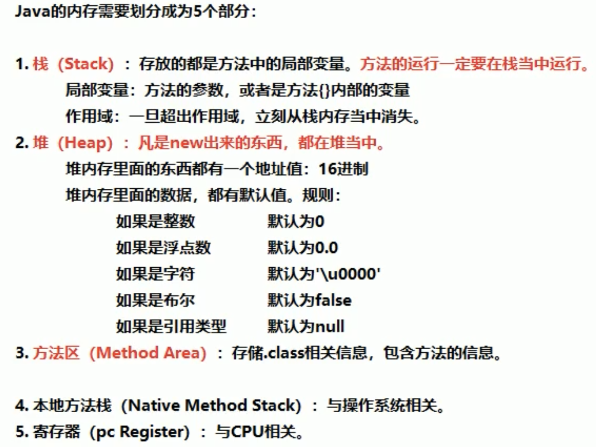
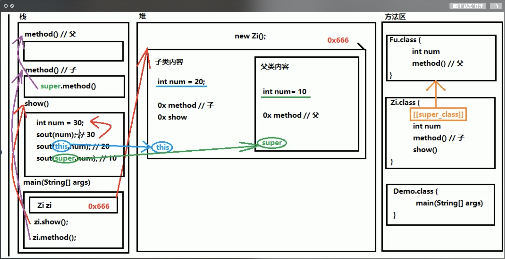

## Java基础知识

### 基本数据类型：
整数型：byte short int long （默认int）
浮点型： float double （默认double, 用float需加上f）
字符型： char （单引号表示）
布尔型：boolean
引用数据类型：
字符串 （双引号表示），数组，类，接口，lambda

数字类型转换：
隐式：数字范围从小到大
强制: int num = (int) 100L (有可能发生数据溢出，精度损失)
**byte/short/char 在计算时提升为int类型**
**boolean 不能发生数据转换**
复合赋值运算符包含“隐含”的强制转换
逻辑运算符（boolean）：与（&&） 或 （`||`）非 (!) (与，或 有“短路效果”，根据左边代码判断最后结果，那么右边代码将不再执行)
一元运算符：！， 自增，自减
二元运算符：赋值，四则运算
三元运算符：变量名称 = 条件判断 ？ 表达式A : 表达式B (int max = a > b ? a : b;)

switch() 括号中的数据类型：
基本类型：byte/short/char/int
引用类型：String字符串，enum枚举


方法重载：
1. 参数个数不用
2. 参数类型不同
3. 参数的多类型顺序不同
4. 与参数名称无关，与返回值类型无关

### java的内存

1. 栈内存 （方法，局部变量）
2. 堆内存 （new出来的）



**局部变量和成员变量**

1. 定义的位置不一样
	1. 局部变量在方法的内部
	2. 成员变量在方外的外部，直接写在类中
2. 作用域不一样
	1. 局部变量只有在方法中才可以使用，除了方法就不行
	2. 成员变量在整个类中都可以使用
3. 默认值不一样
	1. 局部变量没有默认值，如果要用，必须手动赋值
	2. 成员变量没有赋值的话会有默认值，规则和数组等一样
4. 内存的位置不一样
	1. 局部变量位于栈内存
	2. 成员变量位于堆内存
5. 生命周期不一样
	1. 局部变量随着方法进栈而诞生，出栈而消失
	2. 成员变量随着对象创建而诞生，随着对象被垃圾回收而消失


### 面向对象：封装、继承、多态
封装的体现：

- 方法就是一种封装
- 关键字private也是一种封装
封装就是将一些细节信息隐藏起来，对于外界不可见
用private将需要保护的成员变量进行修饰。一旦使用了private修饰，在本类中可以访问，但是超出了类的范围就不能直接访问。（用一对getter/setter进行访问）
对于基本类型中的boolean类型，get方法要写成isXXX形式，set方法规则不变

一个标准的类；
1. 所有的成员变量都要用private关键词修饰
2. 为每一个成员变量写一对getter/setter 方法
3. 编写一个无参数的构造方法
4. 编写一个全参数的构造方法

泛型，代表装在集合中的所有元素，全都是统一的类型
注意，泛型只能是引用类型，不能是基本类型
对于ArrayList集合来说，直接打印得到的不是地址值，而是内容，如果是空，则为`[]`
如果希望向集合中存储基本类型数据，必须使用基本类型对于的包装类 (jdk1.5开始，支持自动装箱，自动拆箱)


字符串特点：
- 字符串是常量，内容不可变
- 字符串是可以共享使用的
- 字符串效果是相当于是`char[]`字符数组，但底层原理是`byte[]` 字节数组

创建字符串的方式（3+1）
三种构造方法 + 一种直接创建
public String() 创建一个空白字符串
public String(`char[] array`) 根据字符数组的内容来创建
public String(`byte[] array`) 根据字节数组的内容来创建


字符串常量池中保持的是byte数组的地址值（底层实现）
字符串常量池(在堆中)，程序中直接写上的双引号的字符串，就在字符串常量池中, new的不在常量池中
对于基本类型来说 == 是进行数值的比较
对于引用类型来说 == 是进行地址值的比较

一旦用了static关键字，那么这样的内容不再属于对象自己，而是属于类的，所以凡是类的对象，都共享这个数据
static修饰成员方法，这就是静态方法。如果没有static，需创建对象，然后使用。对于静态方法，可以通过对象名或者直接通过类名称来调用（推荐类名称调用）。
对于本类中的静态方法，可以省略类名称。
- 静态方法不能直接访问非静态方法 （因为内存中先用静态内容，后有非静态内容）
- 静态方法中不能用this （this代表当前对象，但是静态方法用类名称调用）

根据类名称访问静态成员变量时，全程和对象没关系，只和类有关系。

静态代码块: 当第一次用到类是，只执行唯一一次，静态内容优先于非静态
典型用途：一次性的对静态成员变量进行赋值

```java
public class {
	static {
		System.out.println("Static code block")
	}
}
```

**继承主要解决的问题：共性抽取**
父类：也叫基类，或者超类  子类：也叫派生类  “is-a 关系”
子类可以拥有父类的“内容”；子类可以有自己专有的内容
在父子类继承中，如果成员变量重名，则创建子类时，访问规则：

- **直接通过子类对象访问时，等号左边是谁，就有先用谁，没有则向上找**
- **间接通过成员变量方法访问成员变量:该方法属于谁，就优先用，没有则向上找**
局部变量: 直接写
本类的成员变量：this.成员变量名称
父类的成员变量：super.成员变量
无论是成员方法还是成员变量，如果没有都是向上找父类，绝不会向下找子类的
@override 用来检测方法重写是否正确；子类的返回值范围必须小于等于父类的返回值范围 （Object 是所有类的公共最高父类）； 子类方法的权限必须大于等于父类方法的权限修饰符 (public > protected > (default) > private) (default) 不是关键词，二是代表留空


子类必须调用父类的构造方法，不写则编译器自动加super()， 写了则用指定的super调用，super只能有一个，还必须是第一个
super关键词用法
- 在子类的成员方法中，访问父类的成员变量
- 在子类的成员方法中，访问父类的成员方法
- 在子类的构造方法中，访问父类的构造方法
this关键词的方法
- 在本类的成员方法中，访问本类的成员变量
- 在本类的成员方法中，访问本类的另一个成员方法
- 在本类的构造方法中，访问本类的另一个构造方法 （this 调用必须是第一个语句，也是唯一一个， super和this不能同时使用）



Java语言是单继承的：一个类只能有一个唯一的父类；java语言可以多级继承；一个父类可以有多个子类

抽象类：抽象方法所在的类必须是抽象类
抽象类不能创建对象；抽象类可以有构造方法，供子类创建对象时，初始化父类成员使用
抽象类中不一定包含抽象方法，但是有抽象方法的类必是抽象类
抽象类的子类，必须重写抽象父类中所有的抽象方法，否则编译无法通过，除非该子类也是抽象类


###接口：（java8)

1. 常量 （java7）
2. 抽象方法 （java7）
3. 默认方法 (java8)
4. 静态方法 (java8)
5. 私有方法（java9）
	1. 普通私有方法： 解决多个方法之间的代码重复问题
	2. 静态私有方法：解决多个静态方法之间的代码重复问题
- **接口中的抽象方法，修饰符必须是两个固定的关键字，public abstract， 这两个关键字可以选择性的省略.**
- 接口不能直接使用，必须有一个实现类来实现接口
- 接口的实现类必须覆盖重写接口中所有的抽象方法
- 创建实现类的对象，进行使用
- 如果实现类并没有覆盖重写接口中的所有的抽象方法，那么这个实现类就必须是抽象类M

调用默认方法，如果实现类中没有，会向上找接口
接口的默认方法，可以通过接口对象直接调用；也可以实现覆盖重写
**不能通过接口实现类的对象来调用接口当中的静态方法**，需通过接口名称直接调用其中的静态方法

**接口当中可以定义“成员变量”，但是必须用“public, static final” 三个关键字修饰。从效果上看，就是接口的“常量”**。接口中的常量必须赋值， 常量的名称使用完全大写的字母， e.g. NUM = 12

**接口小结：**

1. 成员变量其实是常量，格式：public static final 数据类型 常量名称=数据值。常量名称完全大写，用下划线进行分离
2. 接口中的最重要的是抽象方法， 格式 public abstract 返回值类型 方法名称（参数列表）实现类必须覆盖重写接口所有的抽象方法，除非实现类是抽象类
3. 从java8开始，接口里允许定义默认方法，格式：public default 返回值类型 方法名称（参数列表）注意：默认方法也可以覆盖重写
4. 从java8开始，接口里允许定义静态方法，格式：public static 返回值类型 方法名称（参数列表）`{方法体}`注意：应该通过接口名称进行调用，不能通过实现类对象调用静态方法
5. 从java9开始，接口里允许定义私有方法，格式 
	1. 普通私有方法：private 返回值类型 方法名称（参数列表）`{方法体}`
	2. 静态私有方法：private static 返回值类型 方法名称（参数列表）`{方法体}`
	3. 注意：private的方法只有接口自己才能调用，不能被实现类或别人调用

**使用接口需要注意：**

1. 接口没有静态代码块和构造方法
2. 一个类的直接父类是唯一的，但是一个类可以有多个实现接口
3. 如果实现类并没有覆盖重写接口中的所有的抽象方法，那么这个实现类就必须是抽象类
4. 如果存在重复的默认方法，那么实现类一定要对默认方法进行覆盖重写
5. 一个类如果直接父类的方法和接口的方法产生了重复，优先用父类的方法 （继承优先于接口实现）


**类与类之间是单继承的**
**类与接口之间 是多实现的**
**接口与接口之间是多继承的**


代码中体现多态性，其实就是一句话，父类引用指向子类对象 (左父右子)
格式：
父类名称 对象名 = new 子类名称（）；
含义：右侧创建一个子类对象，把它当做父类来看待使用（向上转型一定是安全的）
或者:
接口名称 对象名 = new 实现类（）；

在父子类继承中，如果成员变量重名，则创建子类时，访问规则：
- 直接通过子类对象访问时，等号左边是谁，就有先用谁，没有则向上找
- 间接通过成员变量方法访问成员变量:该方法属于谁，就优先用，没有则向上找
成员方法的访问规则是：看new的是谁，就优先用谁，没有就向上找

**成员方法口诀：编译看左边，运行看右边**
**成员变量：编译看左边，运行还看左边**

对象的向下转型，其实是一个还原的过程
格式：子类名称 对象名 = （子类名称）父类对象
含义：将父类对象还原为本来的子类对象

对于类，方法来说，abstract关键字和final关键字不能同时使用，因为矛盾
final 关键字
1. 修饰一个类 （不能有子类，其中所有的成员方法无法进行覆盖重写）
2. 修饰一个方法 （方法不能被覆盖重写）
3. 修饰一个局部变量 （一次赋值，终身不变，基本类型，数值不变；引用类型，地址值不可变）
4. 修饰一个成员变量 （由于成员变量具有默认值，所以用了final之后必须手动赋值；要么直接赋值，要么通过构造方法赋值 ）

**java中的权限修饰符**
			public        >        protected         >        (default) >          private
同一个类          YES                        YES                            YES                   YES
同一个包          YES                        YES                            YES                   NO
不同包子类       YES                        YES                            NO                    NO
不同包非子类   YES                         NO                              NO                   NO

定义一个类的时候，权限修饰规则：
1. 外部类：public / (default)
2. 成员内部类： public/ protected/ (default) / private
3. 局部内部类：什么都不能写 （和default含义不同）

从java8开始，只要局部变量事实不变，那么final关键字可省略
匿名内部类，在创建对象时，只能使用一次。如果希望多次创建对象，则需创建一个实现类
匿名对象，在调用方法时，只能调用唯一一次，如果希望调用多次，则需要给方法取名字
匿名内部类是省略了【实现类/子类】，但是匿名对象省略了【对象名称】


不使用泛型：
- 好处：默认的类型是object类型，可以存储任意类型的数据
- 弊端：不安全，会引发异常
使用泛型：
- 避免类型转换的麻烦，存储什么类型，取出的就是什么类型
- 把运行期异常，提升到了编译期（写代码时就会报错）
格式：
修饰符 <泛型> 返回值类型 方法名（参数列表）（使用泛型））

**可变参数的注意事项：**
当方法的数据类型已经确定，但是参数的个数不确定
格式：修饰符 返回值 方法名 （数据类型… 变量名）
e.g public void method(int…arr)
底层原理：底层是一个数组，根据参数个数不同创建不同长度的数组

- 一个方法的参数列表，只能有一个可变参数
- 如果方法的参数有多个，那么可变参数必须写在参数列表的末尾
终极写法： public static void method (Object… obj)

Comparator和Comparable的区别
Comparable：自己（this）和别人（参数）比较，自己需要实现Comparable的接口，重写比较的规则compareTo方法
Comparator：相当于找一个第三方的裁判，比较两个