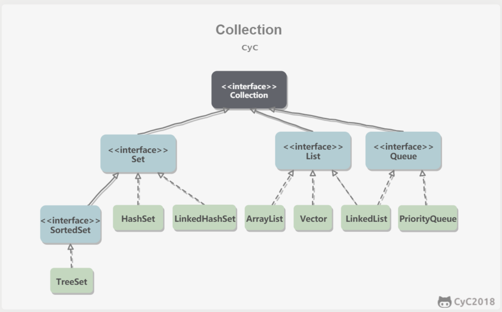

##  Java容器

容器主要包括 Collection 和 Map 两种，Collection 存储着对象的集合，而 Map 存储着键值对（两个对象）的映射表

1. Set
TreeSet：基于红黑树实现，支持有序性操作，例如根据一个范围查找元素的操作。但是查找效率不如 HashSet，HashSet 查找的时间复杂度为 O(1)，TreeSet 则为 O(logN)。
HashSet：基于哈希表实现，支持快速查找，但不支持有序性操作。并且失去了元素的插入顺序信息，也就是说使用 Iterator 遍历 HashSet 得到的结果是不确定的。
LinkedHashSet：具有 HashSet 的查找效率，并且内部使用双向链表维护元素的插入顺序。
2. List
ArrayList：基于动态数组实现，支持随机访问。
Vector：和 ArrayList 类似，但它是线程安全的。
LinkedList：基于双向链表实现，只能顺序访问，但是可以快速地在链表中间插入和删除元素。不仅如此，LinkedList 还可以用作栈、队列和双向队列。
3. Queue
LinkedList：可以用它来实现双向队列。
PriorityQueue：基于堆结构实现，可以用它来实现优先队列。

4. Map
TreeMap：基于红黑树实现。
HashMap：基于哈希表实现。
HashTable：和 HashMap 类似，但它是线程安全的，这意味着同一时刻多个线程同时写入 HashTable 不会导致数据不一致。它是遗留类，不应该去使用它，而是使用 ConcurrentHashMap 来支持线程安全，ConcurrentHashMap 的效率会更高，因为 ConcurrentHashMap 引入了分段锁。
LinkedHashMap：使用双向链表来维护元素的顺序，顺序为插入顺序或者最近最少使用（LRU）顺序。

CopyOnWriteArrayList
1. 读写分离
写操作在一个复制的数组上进行，读操作还是在原始数组中进行，读写分离，互不影响。
写操作需要加锁，防止并发写入时导致写入数据丢失。
写操作结束之后需要把原始数组指向新的复制数组。

HashMap
拉链法的工作原理
应该注意到链表的插入是以头插法方式进行的，例如上面的 <K3,V3> 不是插在 <K2,V2> 后面，而是插入在链表头部。
查找需要分成两步进行：
- 计算键值对所在的桶；
- 在链表上顺序查找，时间复杂度显然和链表的长度成正比

ConcurrentHashMap
JDK 1.7 使用分段锁机制来实现并发更新操作，核心类为 Segment，它继承自重入锁 ReentrantLock，并发度与 Segment 数量相等。
JDK 1.8 使用了 CAS 操作来支持更高的并发度，在 CAS 操作失败时使用内置锁 synchronized。
并且 JDK 1.8 的实现也在链表过长时会转换为红黑树。

**HashTable**
底层数组+链表实现，无论key还是value都不能为null，线程安全，实现线程安全的方式是在修改数据时锁住整个HashTable，效率低，ConcurrentHashMap做了相关优化
初始size为11，扩容：`newsize = olesize*2+1`
计算index的方法：index = (hash & 0x7FFFFFFF) % tab.length
**HashMap**
底层数组+链表实现，可以存储null键和null值，线程不安全
初始size为16，扩容：`newsize = oldsize*2`，size一定为2的n次幂
扩容针对整个Map，每次扩容时，原来数组中的元素依次重新计算存放位置，并重新插入
插入元素后才判断该不该扩容，有可能无效扩容（插入后如果扩容，如果没有再次插入，就会产生无效扩容）
当Map中元素总数超过Entry数组的75%，触发扩容操作，为了减少链表长度，元素分配更均匀
计算index方法：index = hash & (tab.length – 1)

**ConcurrentHashMap**
底层采用分段的数组+链表实现，线程安全
通过把整个Map分为N个Segment，可以提供相同的线程安全，但是效率提升N倍，默认提升16倍。(读操作不加锁，由于HashEntry的value变量是 volatile的，也能保证读取到最新的值。)
Hashtable的synchronized是针对整张Hash表的，即每次锁住整张表让线程独占，ConcurrentHashMap允许多个修改操作并发进行，其关键在于使用了锁分离技术
有些方法需要跨段，比如size()和containsValue()，它们可能需要锁定整个表而而不仅仅是某个段，这需要按顺序锁定所有段，操作完毕后，又按顺序释放所有段的锁
扩容：段内扩容（段内元素超过该段对应Entry数组长度的75%触发扩容，不会对整个Map进行扩容），插入前检测需不需要扩容，有效避免无效扩容

ConcurrentHashMap提供了与Hashtable和SynchronizedMap不同的锁机制。Hashtable中采用的锁机制是一次锁住整个hash表，从而在同一时刻只能由一个线程对其进行操作；而ConcurrentHashMap中则是一次锁住一个桶。
ConcurrentHashMap默认将hash表分为16个桶，诸如get、put、remove等常用操作只锁住当前需要用到的桶。这样，原来只能一个线程进入，现在却能同时有16个写线程执行，并发性能的提升是显而易见的。

**开放地址法：**
1.线性探测法:ThreadLocalMap

线性再散列法是形式最简单的处理冲突的方法。插入元素时，如果发生冲突，算法会简单的从该槽位置向后循环遍历hash表，直到找到表中的下一个空槽，并将该元素放入该槽中（会导致相同hash值的元素挨在一起和其他hash值对应的槽被占用）。查找元素时，首先散列值所指向的槽，如果没有找到匹配，则继续从该槽遍历hash表，直到：（1）找到相应的元素；（2）找到一个空槽，指示查找的元素不存在，（所以不能随便删除元素）；（3）整个hash表遍历完毕（指示该元素不存在并且hash表是满的）

用线性探测法处理冲突，思路清晰，算法简单，但存在下列缺点：
① 处理溢出需另编程序。一般可另外设立一个溢出表，专门用来存放上述哈希表中放不下的记录。此溢出表最简单的结构是顺序表，查找方法可用顺序查找。
② 按上述算法建立起来的哈希表，删除工作非常困难。如果将此元素删除，查找的时会发现空槽，则会认为要找的元素不存在。只能标上已被删除的标记，否则，将会影响以后的查找。
③ 线性探测法很容易产生堆聚现象。所谓堆聚现象，就是存入哈希表的记录在表中连成一片。按照线性探测法处理冲突，如果生成哈希地址的连续序列愈长 ( 即不同关键字值的哈希地址相邻在一起愈长 ) ，则当新的记录加入该表时，与这个序列发生冲突的可能性愈大。因此，哈希地址的较长连续序列比较短连续序列生长得快，这就意味着，一旦出现堆聚 ( 伴随着冲突 ) ，就将引起进一步的堆聚。

**拉链法**
拉链法 : hashmap
拉链法的优点
与开放定址法相比，拉链法有如下几个优点：
①拉链法处理冲突简单，且无堆积现象，即非同义词决不会发生冲突，因此平均查找长度较短；
②由于拉链法中各链表上的结点空间是动态申请的，故它更适合于造表前无法确定表长的情况；
③开放定址法为减少冲突，要求装填因子α较小，故当结点规模较大时会浪费很多空间。而拉链法中可取α≥1，且结点较大时，拉链法中增加的指针域可忽略不计，因此节省空间；
④在用拉链法构造的散列表中，删除结点的操作易于实现。只要简单地删去链表上相应的结点即可。

拉链法的缺点
    　**拉链法的缺点是：指针需要额外的空间，故当结点规模较小时，开放定址法较为节省空间，而若将节省的指针空间用来扩大散列表的规模，可使装填因子变小，这又减少了开放定址法中的冲突，从而提高平均查找速度。**

