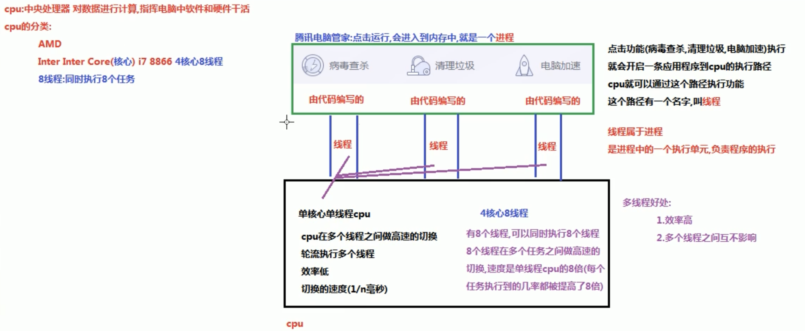
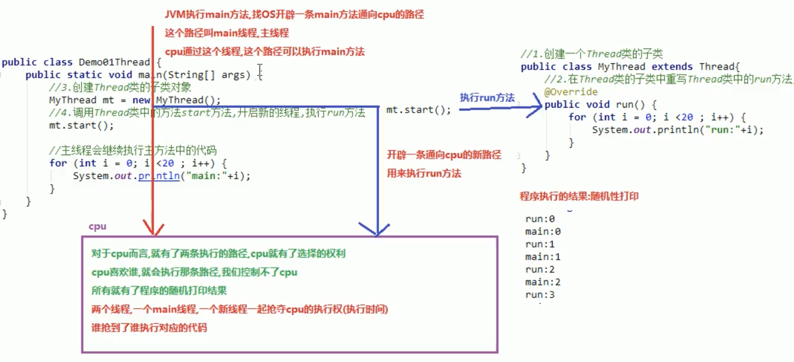
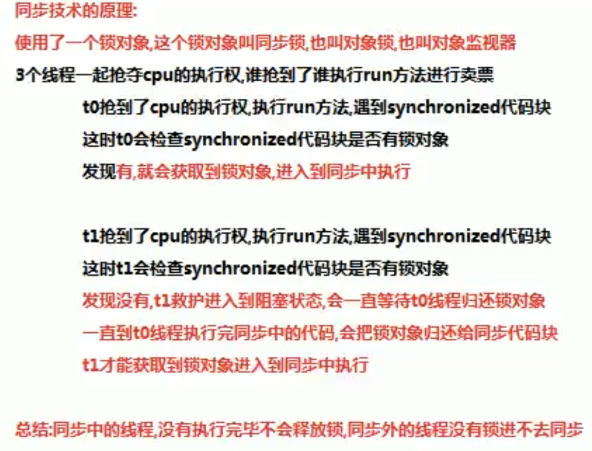
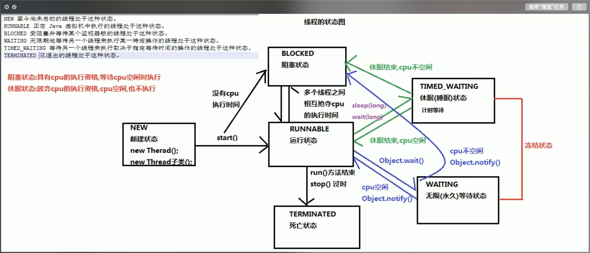

## Java 异常和多线程

### Throwable (超类)

- Error 错误，相当于程序得了无法治愈的病，必须修改代码，程序才能进行
- Exception 编译器异常，编译（写代码）出现的问题
	- RuntimeException（子类）: 运行期异常，运行中出现的问题

java 异常处理关键字：try, catch, finally, throw, throws
throw关键字：可以在指定方法中抛出指定的异常
	格式：throw new xxxException(“异常产生原因”)
	注意：1. throw必须写在方法的内部
		2. new后面的对象必须是exception或者exception的子类对象
		3. 指定的异常对象，必须处理这个异常对象；若是RuntimeException，可以不处理，默认交给JVM处理
		4. 若是编译异常，则需要用try…catch…要么throws
throws关键字:
当方法内部抛出异常对象的时候，那么我们就必须处理这个异常
可以使用throws关键字处理异常对象，会把异常对象声明抛出给方法的调用者处理，最终交给JVM处理—>中断处理 (异常后面的代码不会继续运行)
格式：返回值类型 方法名（参数列表）throws aaaException, bbbException … `{throw new aaaaException("reason 1");    throw new bbbException(“reason 2);}`
注意：
	throws关键字需写在方法声明处
	声明的异常必须是Exception或者Exception的子类
	

try…catch… 自己处理异常
 	1. try中可能会抛出多个异常对象，那么就可以使用多个catch来处理这些异常对象
 	2. 如果try中产生了异常，那么就会执行catch中的异常处理逻辑，继续执行后面的代码

throwable类中定义了3中异常处理的方法
	String getMessage() 简单描述
	String toString() 详细字符消息
	void printStackTrace() 默认调用此方法，打印信息最全面

一个try多个catch，catch里面定义的异常变量如果有子父类关系，那么子类的异常变量必须写在上面，否则就会报错

父子类的异常：父类异常什么样，子类异常就什么样

### 多线程

多线程的好处：多个线程之前互不影响，在不同的栈空间中

实现runnable接口创建多线程的好处：
	1. 避免了单继承的局限性：一个类只能继承一个类，继承了Thread就不能继承其他的类；实现了runnable接口，还可以继承其他类，其他接口
	2. 增强了程序的扩展性，降低了程序的耦合性（解耦），实现类中重写了run方法，用来设置线程任务，创建Thread类对象，调用start方法用来开启新线程

线程同步技术：
 	1. 同步代码快
 	2. 同步方法
 	3. 锁机制
  同步代码块技术原理：
  使用了一个锁对象，这个锁对象叫同步锁，也叫对象锁，也叫对象监视器。

同步方法也会把方法内部的代码锁住，只让一个线程执行，锁对象就是this（实现类对象）
静态的同步方法锁对象不能是this，因为this是创建对象之后产生的，静态方法优于对象，静态方法的锁对象是本类class属性 —》 class文件对象（反射）

使用Lock锁：Lock实现提供了比使用synchronized 方法和语句可获得更广泛的锁定操作: void lock(); void unlock();
ReentrantLock implements Lock 接口

调用wait和notify的注意事项：
1. wait方法和notify方法必须要有同一个锁对象调用，因为，对应的锁对象可以通过notify唤醒使用同一个锁对象调用的wait方法后的线程
2. wait方法和notify方法是属于object类的方法，因为锁对象可以是任意对象，而任意对象的所属类都是继承了object类的
3. wait方法和notify方法必须要在同步代码块或者同步函数中使用，因为必须要通过锁对象调用这2个方法

Lambda 表达式标准格式：
(参数类型 参数名称) -> {代码语句}

写入数据原理：
java程序 — > JVM（虚拟机）—> OS(操作系统) —> OS调用写入数据方法 —> 把数据写入到文件中

OutputStream 字节输出流
InputStream 字节输入流
Writer 字符输出流 （可以写中文）
Reader 字符输入流 （可以读中文）

static关键字：静态优先于非静态加载到内存中（优先于对象进入内存中）静态不能被序列化
transient 关键字：瞬态关键字，被transient修饰的成员变量，不能被序列化

函数式接口：有且只有一个抽象方法的接口，称为函数式接口
当然接口中可以包含其他的方法（默认，静态，私有）
函数式接口一般可以用作方法的参数和返回值类型