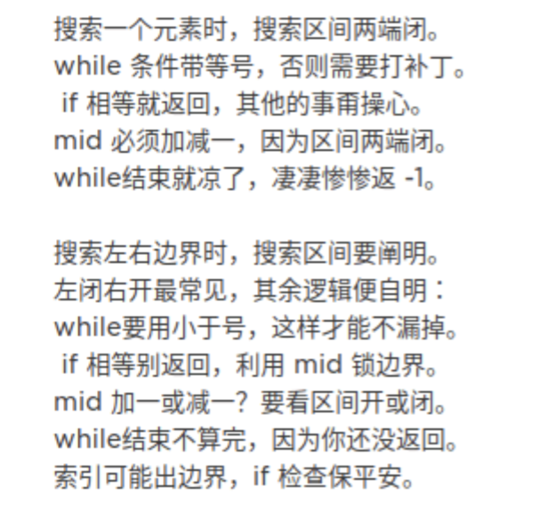

[算法小抄](https://labuladong.gitbook.io/algo/)

###数据结构 

数据结构的存储方式只有两种：数组（顺序存储）和链表（链式存储）

**数组**由于是紧凑连续存储,可以随机访问，通过索引快速找到对应元素，而且相对节约存储空间。但正因为连续存储，内存空间必须一次性分配够，所以说数组如果要扩容，需要重新分配一块更大的空间，再把数据全部复制过去，时间复杂度 O(N)；而且你如果想在数组中间进行插入和删除，每次必须搬移后面的所有数据以保持连续，时间复杂度 O(N)。

**链表**因为元素不连续，而是靠指针指向下一个元素的位置，所以不存在数组的扩容问题；如果知道某一元素的前驱和后驱，操作指针即可删除该元素或者插入新元素，时间复杂度 O(1)。但是正因为存储空间不连续，你无法根据一个索引算出对应元素的地址，所以不能随机访问；而且由于每个元素必须存储指向前后元素位置的指针，会消耗相对更多的储存空间。

### 动态规划

**动态规划问题的一般形式就是求最值**。动态规划其实是运筹学的一种最优化方法，只不过在计算机问题上应用比较多，比如说让你求**最长**递增子序列呀，**最小**编辑距离呀等等

首先，动态规划的穷举有点特别，因为这类问题**存在「重叠子问题」**，如果暴力穷举的话效率会极其低下，所以需要「备忘录」或者「DP table」来优化穷举过程，避免不必要的计算。

而且，动态规划问题一定会**具备「最优子结构」**，才能通过子问题的最值得到原问题的最值。

另外，虽然动态规划的核心思想就是穷举求最值，但是问题可以千变万化，穷举所有可行解其实并不是一件容易的事，只有列出**正确的「状态转移方程**」才能正确地穷举。

以上提到的重叠子问题、最优子结构、状态转移方程就是动态规划三要素

明确「状态」 -> 定义 dp 数组/函数的含义 -> 明确「选择」-> 明确 base case。

带备忘录的递归解法的效率已经和迭代的动态规划解法一样了。实际上，这种解法和迭代的动态规划已经差不多了，只不过这种方法叫做「自顶向下」，动态规划叫做「自底向上」。

啥叫「自顶向下」？注意我们刚才画的递归树（或者说图），是从上向下延伸，都是从一个规模较大的原问题比如说 `f(20)`，向下逐渐分解规模，直到 `f(1)` 和 `f(2)` 触底，然后逐层返回答案，这就叫「自顶向下」。

啥叫「自底向上」？反过来，我们直接从最底下，最简单，问题规模最小的 `f(1)` 和 `f(2)` 开始往上推，直到推到我们想要的答案 `f(20)`，这就是动态规划的思路，这也是为什么动态规划一般都脱离了递归，而是由循环迭代完成计算。


**计算机解决问题其实没有任何奇技淫巧，它唯一的解决办法就是穷举**，穷举所有可能性。算法设计无非就是先思考“如何穷举”，然后再追求“如何聪明地穷举”。

列出动态转移方程，就是在解决“如何穷举”的问题。之所以说它难，一是因为很多穷举需要递归实现，二是因为有的问题本身的解空间复杂，不那么容易穷举完整。

备忘录、DP table 就是在追求“如何聪明地穷举”。用**空间换时间**的思路，是降低时间复杂度的不二法门


### 回溯算法

**解决一个回溯问题，实际上就是一个决策树的遍历过程**。你只需要思考 3 个问题：

1、路径：也就是已经做出的选择。

2、选择列表：也就是你当前可以做的选择。

3、结束条件：也就是到达决策树底层，无法再做选择的条件。

```java
result = []
def backtrack(路径, 选择列表):
    if 满足结束条件:
        result.add(路径)
        return

    for 选择 in 选择列表:
        做选择
        backtrack(路径, 选择列表)
        撤销选择
```

其核心就是 for 循环里面的递归，在递归调用之前「做选择」，在递归调用之后「撤销选择」


### 二分查找



分析二分查找的一个技巧是：不要出现 else，而是把所有情况用 else if 写清楚，这样可以清楚地展现所有细节

**寻找一个数（基本的二分搜索）**

```java
int binarySearch(int[] nums, int target) {
    int left = 0; 
    int right = nums.length - 1; // 注意

    while(left <= right) {
        int mid = left + (right - left) / 2;
        if(nums[mid] == target)
            return mid; 
        else if (nums[mid] < target)
            left = mid + 1; // 注意
        else if (nums[mid] > target)
            right = mid - 1; // 注意
    }
    return -1;
}
```

**寻找左侧边界的二分搜索**

```java
int left_bound(int[] nums, int target) {
    if (nums.length == 0) return -1;
    int left = 0;
    int right = nums.length; // 注意

    while (left < right) { // 注意
        int mid = (left + right) / 2;
        if (nums[mid] == target) {
            right = mid;
        } else if (nums[mid] < target) {
            left = mid + 1;
        } else if (nums[mid] > target) {
            right = mid; // 注意
        }
    }
    return left;
}

## 两端都闭合的搜索区间
int left_bound(int[] nums, int target) {
    int left = 0, right = nums.length - 1;
    // 搜索区间为 [left, right]
    while (left <= right) {
        int mid = left + (right - left) / 2;
        if (nums[mid] < target) {
            // 搜索区间变为 [mid+1, right]
            left = mid + 1;
        } else if (nums[mid] > target) {
            // 搜索区间变为 [left, mid-1]
            right = mid - 1;
        } else if (nums[mid] == target) {
            // 收缩右侧边界
            right = mid - 1;
        }
    }
    // 检查出界情况
    if (left >= nums.length || nums[left] != target)
        return -1;
    return left;
}
```

二分查找闭合搜索

```java
int binary_search(int[] nums, int target) {
    int left = 0, right = nums.length - 1; 
    while(left <= right) {
        int mid = left + (right - left) / 2;
        if (nums[mid] < target) {
            left = mid + 1;
        } else if (nums[mid] > target) {
            right = mid - 1; 
        } else if(nums[mid] == target) {
            // 直接返回
            return mid;
        }
    }
    // 直接返回
    return -1;
}

int left_bound(int[] nums, int target) {
    int left = 0, right = nums.length - 1;
    while (left <= right) {
        int mid = left + (right - left) / 2;
        if (nums[mid] < target) {
            left = mid + 1;
        } else if (nums[mid] > target) {
            right = mid - 1;
        } else if (nums[mid] == target) {
            // 别返回，锁定左侧边界
            right = mid - 1;
        }
    }
    // 最后要检查 left 越界的情况
    if (left >= nums.length || nums[left] != target)
        return -1;
    return left;
}


int right_bound(int[] nums, int target) {
    int left = 0, right = nums.length - 1;
    while (left <= right) {
        int mid = left + (right - left) / 2;
        if (nums[mid] < target) {
            left = mid + 1;
        } else if (nums[mid] > target) {
            right = mid - 1;
        } else if (nums[mid] == target) {
            // 别返回，锁定右侧边界
            left = mid + 1;
        }
    }
    // 最后要检查 right 越界的情况
    if (right < 0 || nums[right] != target)
        return -1;
    return right;
}
```

1、分析二分查找代码时，不要出现 else，全部展开成 else if 方便理解。

2、注意「搜索区间」和 while 的终止条件，如果存在漏掉的元素，记得在最后检查。

3、如需定义左闭右开的「搜索区间」搜索左右边界，只要在 `nums[mid] == target` 时做修改即可，搜索右侧时需要减一。

4、如果将「搜索区间」全都统一成两端都闭，好记，只要稍改 `nums[mid] == target` 条件处的代码和返回的逻辑即可


### 滑动窗口算法

**最小覆盖子串**

就是说要在 `S`(source) 中找到包含 `T`(target) 中全部字母的一个子串，且这个子串一定是所有可能子串中最短的。

```c++
//最小覆盖子串
string minWindow(string s, string t) {
    unordered_map<char, int> need, window;
    for (char c : t) need[c]++;

    int left = 0, right = 0;
    int valid = 0;
    // 记录最小覆盖子串的起始索引及长度
    int start = 0, len = INT_MAX;
    while (right < s.size()) {
        // c 是将移入窗口的字符
        char c = s[right];
        // 右移窗口
        right++;
        // 进行窗口内数据的一系列更新
        if (need.count(c)) {
            window[c]++;
            if (window[c] == need[c])
                valid++;
        }

        // 判断左侧窗口是否要收缩
        while (valid == need.size()) {
            // 在这里更新最小覆盖子串
            if (right - left < len) {
                start = left;
                len = right - left;
            }
            // d 是将移出窗口的字符
            char d = s[left];
            // 左移窗口
            left++;
            // 进行窗口内数据的一系列更新
            if (need.count(d)) {
                if (window[d] == need[d])
                    valid--;
                window[d]--;
            }                    
        }
    }
    // 返回最小覆盖子串
    return len == INT_MAX ?
        "" : s.substr(start, len);
}
```

**最长无重复子串**

```C++
int lengthOfLongestSubstring(string s) {
    unordered_map<char, int> window;

    int left = 0, right = 0;
    int res = 0; // 记录结果
    while (right < s.size()) {
        char c = s[right];
        right++;
        // 进行窗口内数据的一系列更新
        window[c]++;
        // 判断左侧窗口是否要收缩
        while (window[c] > 1) {
            char d = s[left];
            left++;
            // 进行窗口内数据的一系列更新
            window[d]--;
        }
        // 在这里更新答案
        res = max(res, right - left);
    }
    return res;
}
```


### 双指针

双指针技巧再分为两类，一类是「**快慢指针**」，一类是「**左右指针**」。前者解决主要解决链表中的问题，比如典型的判定链表中是否包含环；后者主要解决数组（或者字符串）中的问题，比如二分查找。

**判定链表中是否含有环**

```c++
boolean hasCycle(ListNode head) {
    ListNode fast, slow;
    fast = slow = head;
    while (fast != null && fast.next != null) {
        fast = fast.next.next;
        slow = slow.next;

        if (fast == slow) return true;
    }
    return false;
}
```

**反转数组**

```c++
void reverse(int[] nums) {
    int left = 0;
    int right = nums.length - 1;
    while (left < right) {
        // swap(nums[left], nums[right])
        int temp = nums[left];
        nums[left] = nums[right];
        nums[right] = temp;
        left++; right--;
    }
}
```


### BFS算法

DFS 算法就是回溯算法

BFS 相对 DFS 的最主要的区别是：**BFS 找到的路径一定是最短的，但代价就是空间复杂度比 DFS 大很多**

```c++
// 计算从起点 start 到终点 target 的最近距离
int BFS(Node start, Node target) {
    Queue<Node> q; // 核心数据结构
    Set<Node> visited; // 避免走回头路

    q.offer(start); // 将起点加入队列
    visited.add(start);
    int step = 0; // 记录扩散的步数

    while (q not empty) {
        int sz = q.size();
        /* 将当前队列中的所有节点向四周扩散 */
        for (int i = 0; i < sz; i++) {
            Node cur = q.poll();
            /* 划重点：这里判断是否到达终点 */
            if (cur is target)
                return step;
            /* 将 cur 的相邻节点加入队列 */
            for (Node x : cur.adj())
                if (x not in visited) {
                    q.offer(x);
                    visited.add(x);
                }
        }
        /* 划重点：更新步数在这里 */
        step++;
    }
}
```

**二叉树的最小高度**

```java
int minDepth(TreeNode root) {
    if (root == null) return 0;
    Queue<TreeNode> q = new LinkedList<>();
    q.offer(root);
    // root 本身就是一层，depth 初始化为 1
    int depth = 1;

    while (!q.isEmpty()) {
        int sz = q.size();
        /* 将当前队列中的所有节点向四周扩散 */
        for (int i = 0; i < sz; i++) {
            TreeNode cur = q.poll();
            /* 判断是否到达终点 */
            if (cur.left == null && cur.right == null) 
                return depth;
            /* 将 cur 的相邻节点加入队列 */
            if (cur.left != null)
                q.offer(cur.left);
            if (cur.right != null) 
                q.offer(cur.right);
        }
        /* 这里增加步数 */
        depth++;
    }
    return depth;
}
```

