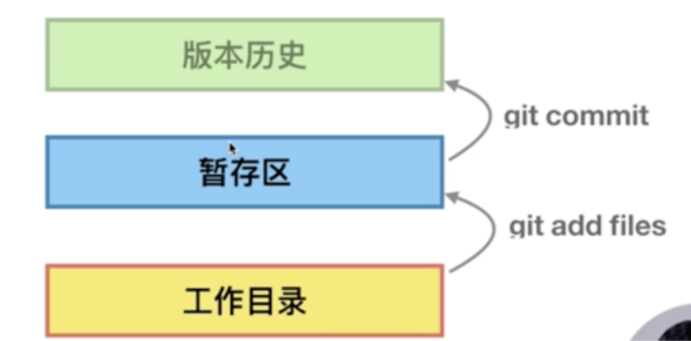
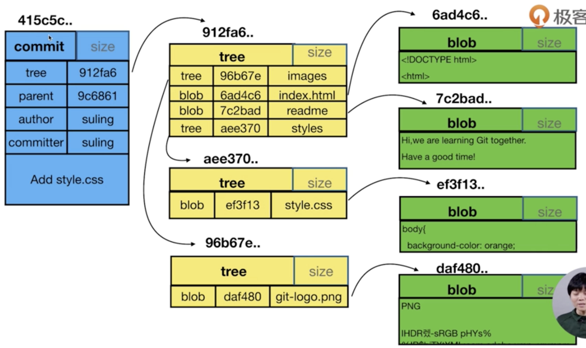
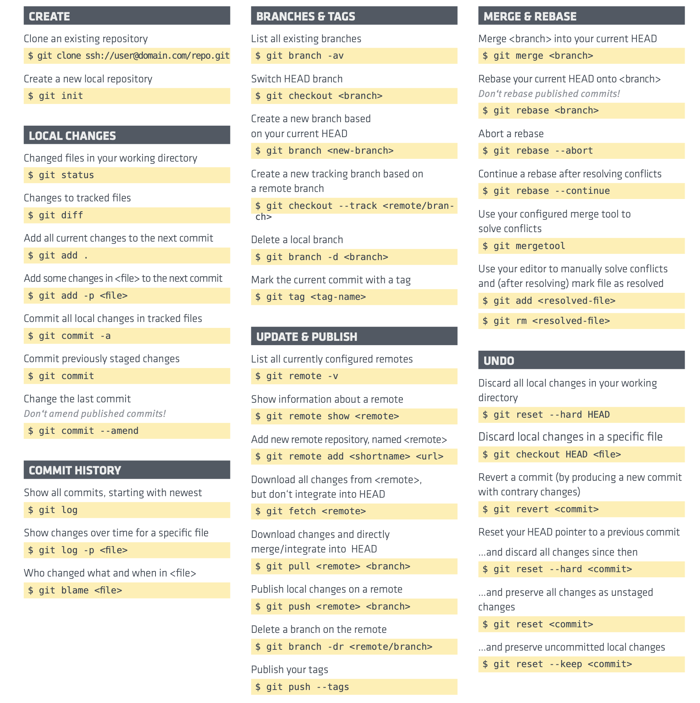

# Git 配置

git 学习网站

https://learngitbranching.js.org/?locale=zh_CN




配置 user.name 和 user.email
git config — global user.name “you name”
git config — global user.email “your email address”

显示config的配置 加  - - list

建立git仓库
1. 把已有项目代码纳入git管理
	cd 项目代码所在的文件夹
	git init
2. 新建的项目直接用git管理
	git init your_project_
	cd your_project_
(img)
git add .：将工作空间新增和被修改的文件添加的暂存区
git add -u:将工作空间被修改和被删除的文件添加到暂存区(不包含没有纳入Git管理的新增文件)

**git reset --hard 清除暂存**
重命名git mv oldFileNmae newFileNmae

•	git log --all 查看所有分支的历史
•	git log --all --graph 查看图形化的 log 地址
•	git log --oneline 查看单行的简洁历史。
•	git log --oneline -n4 查看最近的四条简洁历史。
•	git log --oneline --all -n4 --graph 所有分支最近 4 条单行的图形化历史。
•	git help --web log 跳转到git log 的帮助文档网页
**加上 --decorate参数 部分同学才可以显示（master）(temp)等分支信息**
`什么时候用-- 什么时候用-呢，我看到有些参数加了两个-，-n4又是只加了一个
根据老师的指示，看了一下 git help log 文档，发现似乎是单字母的参数是 '-'，非单字母的参数是'--'。`

//cat命令主要用来查看文件内容，创建文件，文件合并，追加文件内容等功能。
cat HEAD 查看HEAD文件的内容 
git cat-file 命令 显示版本库对象的内容、类型及大小信息。
**git cat-file -t** b44dd71d62a5a8ed3 显示版本库对象的类型
git cat-file -s b44dd71d62a5a8ed3 显示版本库对象的大小
**git cat-file -p** b44dd71d62a5a8ed3 显示版本库对象的内容

HEAD：指向当前的工作路径
config：存放本地仓库（local）相关的配置信息。
refs/heads:存放分支
refs/tags:存放tag，又叫里程牌 （当这次commit是具有里程碑意义的 比如项目1.0的时候 就可以打tag）
objects：存放对象 .git/objects/ 文件夹中的子文件夹都是以哈希值的前两位字符命名 每个object由40位字符组成，前两位字符用来当文件夹，后38位做文件。



**git commit -am** “add and commit”
git commit --amend 对最新一次提交做 commit 修改
**修改历史commit的message，git rebase -i xx(父亲版本号)**
git rebase -i --root 修改第一次的提交
(对于团队中公用的分支，例如发布分支等，禁用 rebase，因为这样会破坏历史的 commit 信息的，将来要溯源、基于构建历史拉取补丁分支等就会带来极大不便)

如果临时想基于某个commit做变更，试试新方案是否可行，就可以采用分离头指针的方式。测试后发现新方案不成熟，直接reset回其他分支即可。省却了建、删分支的麻烦了。

git branch -d branch-name:使用-d 在删除前Git会判断在该分支上开发的功能是否被merge的其它分支。如果没有，不能删除。如果merge到其它分支，但之后又在其上做了开发，使用-d还是不能删除。-D会强制删除。

`想要恢复被删除的分支呢
https://stackoverflow.com/questions/3640764/can-i-recover-a-branch-after-its-deletion-in-git 
可以再了解一下 git reflog 这个命令的作用。`

```html
暂存区与HEAD中比较
git diff —staged 和 git diff —cached

假定：HEAD、暂存区、工作区中的readme.md文件内容均不相同。
git diff HEAD -- readme.md # 工作区 <===> HEAD
git diff -- readme.md # 工作区 <===> 暂存区
git diff --cached -- readme.md # 暂存区 <===> HEAD
//看看不同提交的指定文件的差异
git diff commit-id1 commit-id2 path-to-filename
```


**git reset** 有三个参数
**--soft** 这个只是把 HEAD 指向的 commit 恢复到你指定的 commit，暂存区 工作区不变
**--hard** 这个是 把 HEAD， 暂存区， 工作区 都修改为 你指定的 commit 的时候的文件状态
--mixed 这个是不加时候的默认参数，把 HEAD，暂存区 修改为 你指定的 commit 的时候的文件状态，工作区保持不变

reset命令不加 --hard，则暂存区的内容恢复成HEAD对应的内容，工作区的变更继续保留。
如果加了 --hard，则不管工作区还是暂存区，内容都变回HEAD对应的内容。

```java
C1 <-- C2 <-- C3 <-- C4 , Cn全部是commit，且C1是C2的父亲，依此类推。

你的问题是说“如果C3有问题，你想撤销C3的修改，为此生成C5，历史树变成C1 <-- C2 <-- C3 <-- C4 <-- C5”，对吗？如果是这样，执行 git revert C3 ，就会生成C5，且C5就是清除C3的变更 。

如果你无须保留 C3和C4，只想让分支回到C2，那么执行 git reset --hard C2 。⚠️我用了--hard，它会把工作区和暂存区都回退到C2，如果你想保留工作区，请不要使用 --hard ；如果甚至想保留暂存区的变更，那么必须加上 --soft C2。

有空请理解reset带了不同参数的三个操作的区别：
git reset --hard C2
git reset C2
git reset --soft C2

C2代表某个commit
```


**1.暂存区恢复成HEAD：git reset**
**2.工作区恢复成暂存区：git checkout**

```java
修改了工作区，恢复：git checkout 

add后，想撤销： git reset HEAD 

commit后，想撤销： git reset--hard hash值

后悔药
先 git reflog 查看命令历史, 记录每次的命令
然后进行你想找回的commit
git reset --hard commit_id
```

git stash

```java
git stash 把当前工作区的内容放入暂存区
git stash pop 把暂存区的内容恢复到工作区，且删除
git stash apply把暂存区的内容恢复到工作区，且保留
我们一般会使用 git stash save ""mse""的方式保存 更容易区分是哪个
git stash list 命令显示的最左一列就是stash的序号，如stash@{2} 和 stash@{1}，序号中数字大的代表的是较早的stash。我们pop的时候可以加具体的序号，不加序号的（缺省情况下）为 stash@{0}。

用法：git stash pop stash@{2}
            git stash pop = git stash pop stash@{0}

这种情况下，我想要的效果是 unstash之后 feature分支上的代码即包括我新增代码又修复了bug。怎么办？

比较不麻烦的做法，分两步走。

1）在feature分支上，先把dev上修复bug的那个commit 执行cherry-pick。

2）再git stash pop继续开发。

```

还原
1）找个目录执行 clone 。或
2）用init建个git仓库，然后从备份数据库添加remote，再push到新建仓库；或者
3）用init建个git仓库，然后在新仓库添加remote，再把备份数据库fetch/pull到新仓库。

**merge, fetch, pull**

git remote -v 查看远程版本库信息
git remote add github <url> 添加github远程版本库
git fetch github 拉取远程版本库
git merge -h 查看合并帮助信息
git merge --allow-unrelated-histories github/master 合并github上的master分支（两分支不是父子关系，所以合并需要添加 --allow-unrelated-histories）
git push github 推送同步到github仓库

在不用merge用rebase的情况下怎么操作能说一下嘛？
1）先把远端的分支 fetch到本地，然后，再执行 rebase 。
2）直接 git pull --rebase 

```java
关于其他同学遇到的ssh权限问题，我看到网上有个测试方法：`ssh -T git@github.com`，成功与否都会有相应提示。我一开始总报错denied，然后发现可以用`ssh -vT git@github.com`看具体发生了什么，发现ssh并没有使用我刚才生成的key，查了一圈，发现需要改`~/.ssh/config`这个文件。

假设我们通过命令生成的是`my_key`和`my_key.pub`，那么可以添加如下信息到`~/.ssh/config`下：
`
# gitee
Host gitee.com
HostName gitee.com
PreferredAuthentications publickey
IdentityFile ~/.ssh/my_key

# github
Host github.com
HostName github.com
PreferredAuthentications publickey
IdentityFile ~/.ssh/my_key
`
此处我除了github，还另外添加了gitee，如果有其他服务器比如公司的仓库，也应该能一起添加进去的。然后确保github或者gitee上自己profile里ssh部分，添加了`my_key.pub`里面的公钥内容，那么此时用命令：`ssh -T git@github.com`，就报成功了。然后就可以愉快地用使用`git@github.com:xxx`的地址进行ssh通信了

```

merge rebase到底有什么区别
git的merge命令，不会改变两个分支已有的版本历史，只会把两个分支合并后创建出一个新的commit出来。
git的rebase命令，假设当前在A分支，要基于B分支做rebase，那么，先找到A和B最近的公共祖先C1，从C1到A之间的所有commit，都基于B重新生成新的commit。看来，rebase通常会修改某个分支的历史。

```java
请问git能不能merge 其他分支的指定文
根据你的问题，我先查了merge命令，且动手测试了，发现该命令不提供这个功能，但是有其他方法。
以后大家有问题，可以google或必应上用英文搜索git的问题。https://stackoverflow.com/questions/5717026/how-to-git-cherry-pick-only-changes-to-certain-files

这里面我看 git show SHA -- file1.txt file2.txt | git apply --cached - 这个方法应该可以满足你的要求。

假设 f1 和 f2 两个分支，f2改了 readme ，a.java，b.java这三个文件，f1 想直接把f2最新修改的 readme 和 b.java 同步过来。那么：
1）先切换到 f1 分支。
2）执行 git show f2 -- readme b.java | git apply -
3) f1 测试没问题后，再执行 add 和 commit 命令
4）f1 的readme和b.java内容就喝 f2 相同了。

```


**Git Cheat Sheet**



