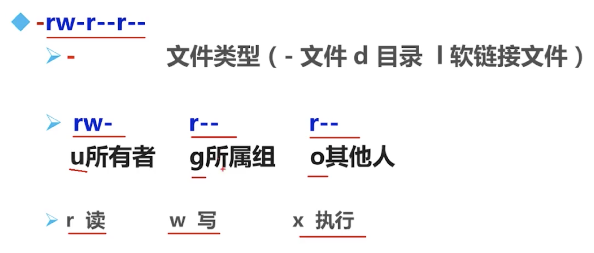

# Linux 权限

文件的基本权限

chmod 命令
chmod 【选项】模式 文件名

- 选项 -R 递归
- 模式 
	- 【ugoa】【+-=】【rwx】
	- 【mode=421】
r: 读取文件（cat more head tail）
w: 编辑，新增，修改文件 (vi echo) 但是不包含删除文件 (需要目录有w权限)
x: 可执行
对文件来讲，最高权限是 x
对目录来讲，最高权限是w （权限只能是 0， 5（rx）， 7（rwx））

改变文件所有者
chown 用户名 文件名
改变文件所属组
chgrp 组名 文件名