# Vim
模式
- 普通
	- 打开默认模式
	- 移查删改
- 可视化 (v)
	- 对一整块区域操作
- 插入模式（i）
	- 添加文本
- 命令
	- 和普通模式类似

移动到行首：数字0 或者shift 6
移动到行尾：$
下一个字符：w 或者W
反向移动： b/B
正向移动下一单词结尾： e/E

**基本操作**

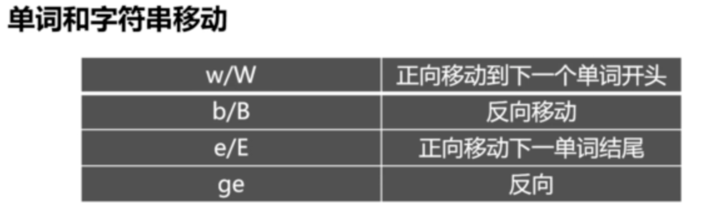

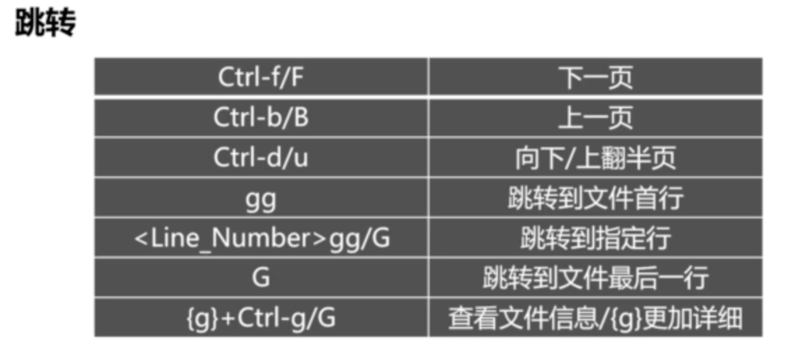

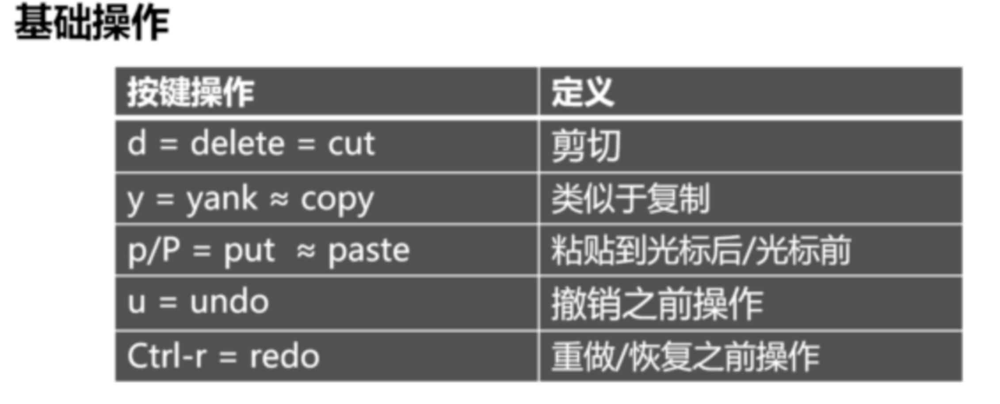

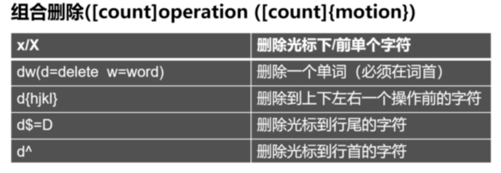

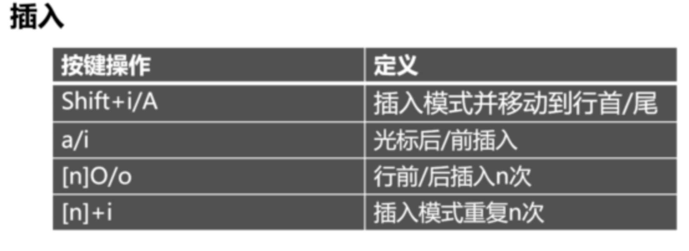

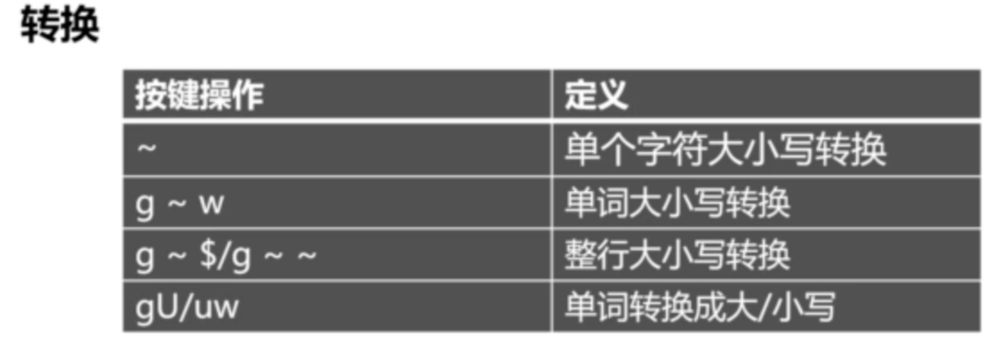

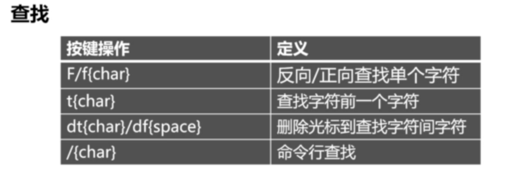

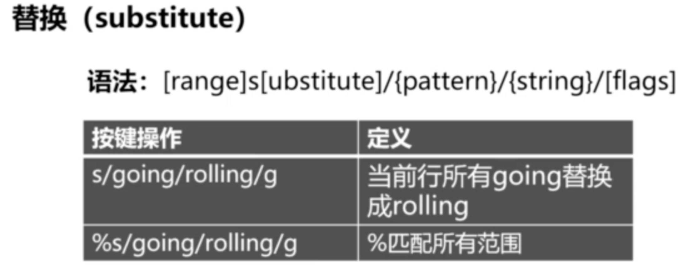

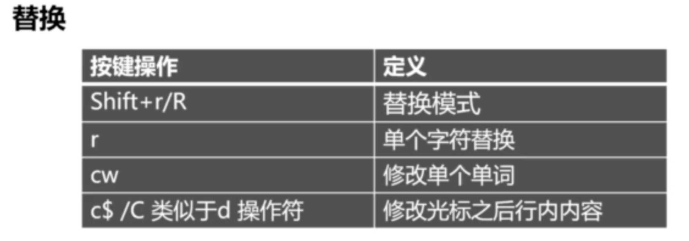

**Cheat Sheet**

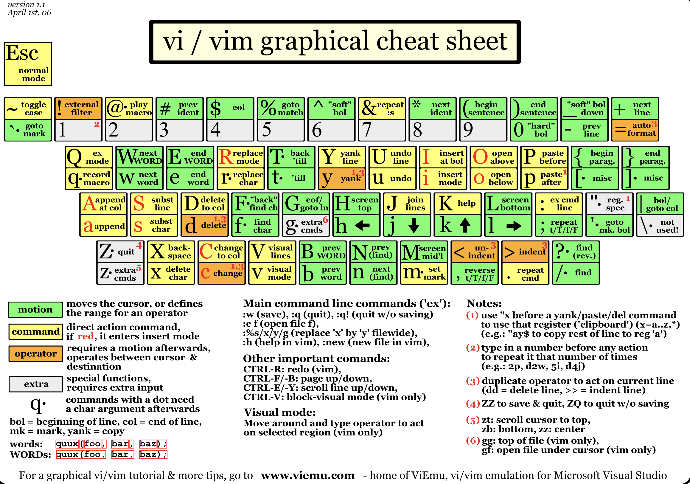

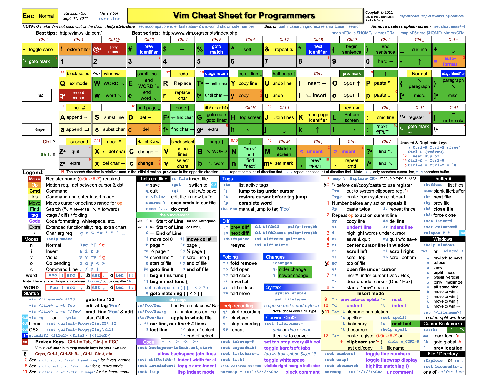