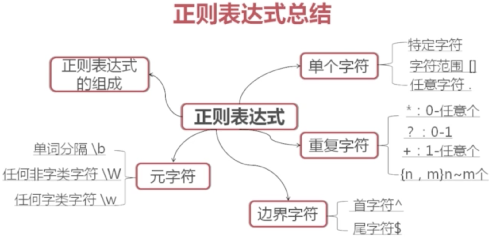

# 正则表达式

- 特定字符 ‘x’
- 范围字符： [], [^]
- 任意字符： .

边界字符：头尾字符
^: 头字符
$: 尾字符

空行的表示：^$

元字符（代表普通字符或者特殊字符）
\w: 匹配任何字符 （数字，字母，下划线）`[a-zA-Z0-9]`
\W:` [^a-zA-Z0-9]`
\b: 单词的分隔

重复：
*：零次或多次
+：一次或多次
？：零次或一次

- 重复的表示: *， + ， ？ ， {m, n}

圆括号，花括号，逻辑| ， 加号，问号，前需要加上”\” 反斜杠

