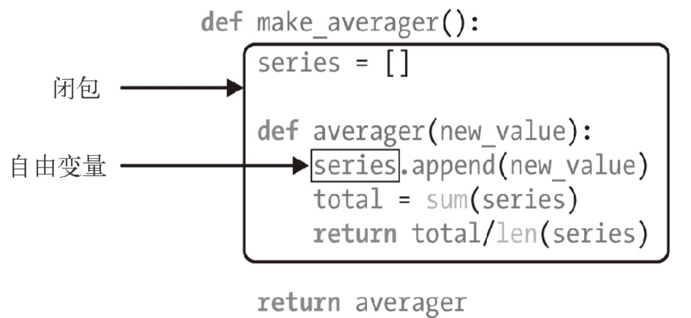
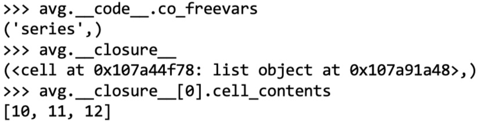
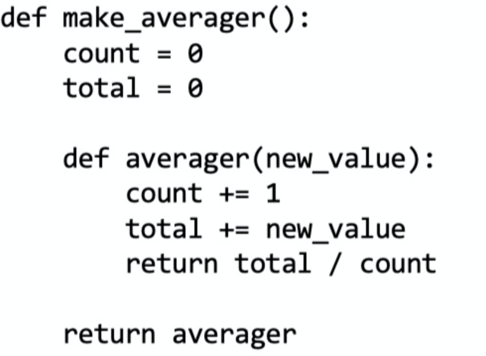
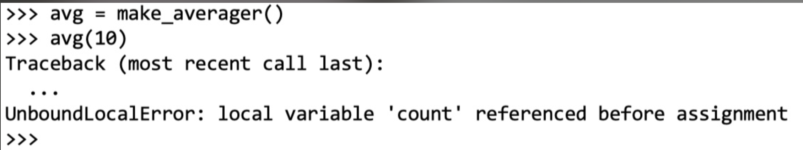
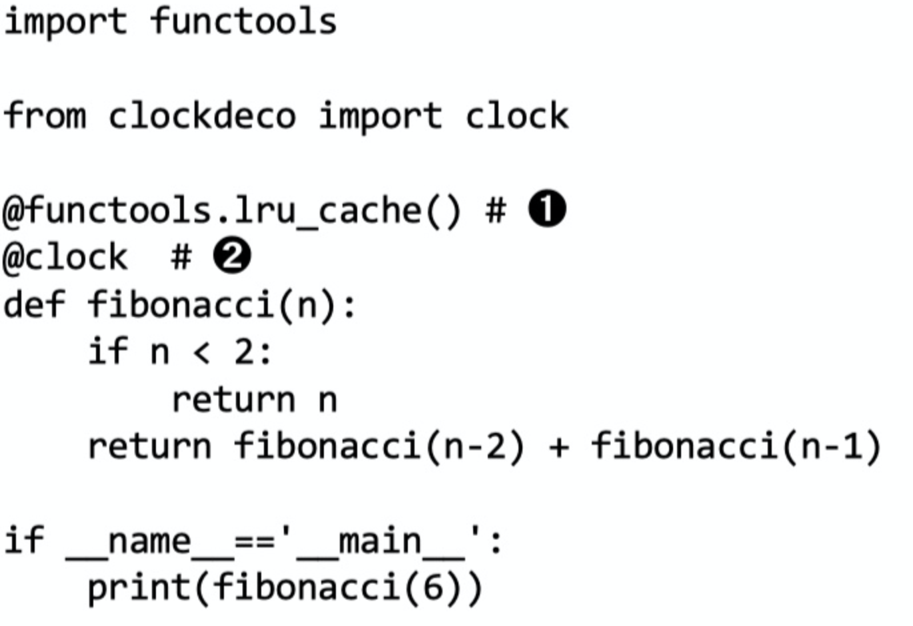
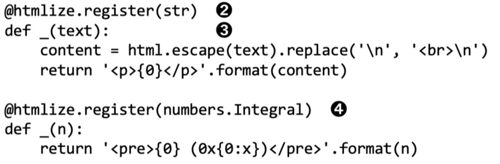

## Python Clousure

装饰器的一个关键特性是，它们在被装饰的函数定义之后立即运行。这通常是在导入时 （即 Python 加载模块时）

闭包指延伸了作用域的函数，其中包含函数定义体中引用、但是不在定义体中定义 的非全局变量。函数是不是匿名的没有关系，关键是它能访问定义体之外定义的非全局变 量。

```python
def make_averager():

  series = []

  def averager(new_value):

    series.append(new_value) total = sum(series) return total/len(series)

  return averager
```



series 的绑定在返回的 avg 函数的 __closure__ 属性中。avg.__closure__ 中的各个 元素对应于 avg.__code__.co_freevars 中的一个名称。这些元素是 cell 对象，有个 cell_contents 属性，保存着真正的值。这些属性的值如示例 7-12 所示









问题是，当 count 是数字或任何不可变类型时，count += 1 语句的作用其实与 count = count + 1 一样。因此，我们在 averager 的定义体中为 count 赋值了，这会把 count 变成局部变量。total 变量也受这个问题影响。

示例 7-9 没遇到这个问题，因为我们没有给 series 赋值，我们只是调用 series.append，并把它传给 sum 和 len。也就是说，我们利用了列表是可变的对象这 一事实。

为了解决这个问题，Python 3 引入了 nonlocal 声明。它的作用是把变量标记为自由变 量，即使在函数中为变量赋予新值了，也会变成自由变量。如果为 nonlocal 声明的变量 赋予新值，闭包中保存的绑定会更新。

python引用变量的顺序： 当前作用域局部变量->外层作用域变量->当前模块中的全局变量->python内置变量 。
**nonlocal关键字用来在函数或其他作用域中使用外层(非全局)变量。**
global关键字用来在函数或其他局部作用域中使用全局变量。但是如果不修改全局变量也可以不使用global关键字。


```python
def make_counter():
    count = 0
    def counter():
        nonlocal count
        count += 1
        return count
    return counter

def make_counter_test():
  mc = make_counter()
  print(mc())
  print(mc())
  print(mc())

make_counter_test()

# 1
# 2
# 3

```

```python
def scope_test():
    def do_local():
        spam = "local spam" #此函数定义了另外的一个spam字符串变量，并且生命周期只在此函数内。此处的spam和外层的spam是两个变量，如果写出spam = spam + “local spam” 会报错
    def do_nonlocal():
        nonlocal  spam        #使用外层的spam变量
        spam = "nonlocal spam"
    def do_global():
        global spam
        spam = "global spam"
    spam = "test spam"
    do_local()
    print("After local assignmane:", spam)
    do_nonlocal()
    print("After nonlocal assignment:",spam)
    do_global()
    print("After global assignment:",spam)
 
scope_test()
print("In global scope:",spam)


# output
After local assignmane: test spam
After nonlocal assignment: nonlocal spam
After global assignment: nonlocal spam
In global scope: global spam
```


functools.lru_cache 是非常实用的装饰器，它实现了备忘（memoization）功能_



functools.lru_cache(maxsize=128, typed=False)
maxsize 参数指定存储多少个调用的结果。缓存满了之后，旧的结果会被扔掉，腾出空 间。为了得到最佳性能，maxsize 应该设为 2 的幂。typed 参数如果设为 True，把不同 参数类型得到的结果分开保存，即把通常认为相等的浮点数和整数参数（如 1 和 1.0）区 分开。顺便说一下，因为 lru_cache 使用字典存储结果，而且键根据调用时传入的定位 参数和关键字参数创建，所以被 lru_cache 装饰的函数，它的所有参数都必须是可散列 的。

Python 3.4 新增的 functools.singledispatch 装饰器可以把整体方案拆分成多个模 块，甚至可以为你无法修改的类提供专门的函数。使用 @singledispatch 装饰的普通函 数会变成泛函数（generic function）：根据第一个参数的类型，以不同方式执行相同操作 的一组函数。 4 具体做法参见示例 7-21。

❶ @singledispatch 标记处理 object 类型的基函数。 
❷ 各个专门函数使用 @«base_function».register(«type») 装饰。_



singledispatch 机制的一个显著特征是，你可以在系统的任何地方和任何模块中注册专 门函数。如果后来在新的模块中定义了新的类型，可以轻松地添加一个新的专门函数来处 理那个类型。此外，你还可以为不是自己编写的或者不能修改的类添加自定义函数。


