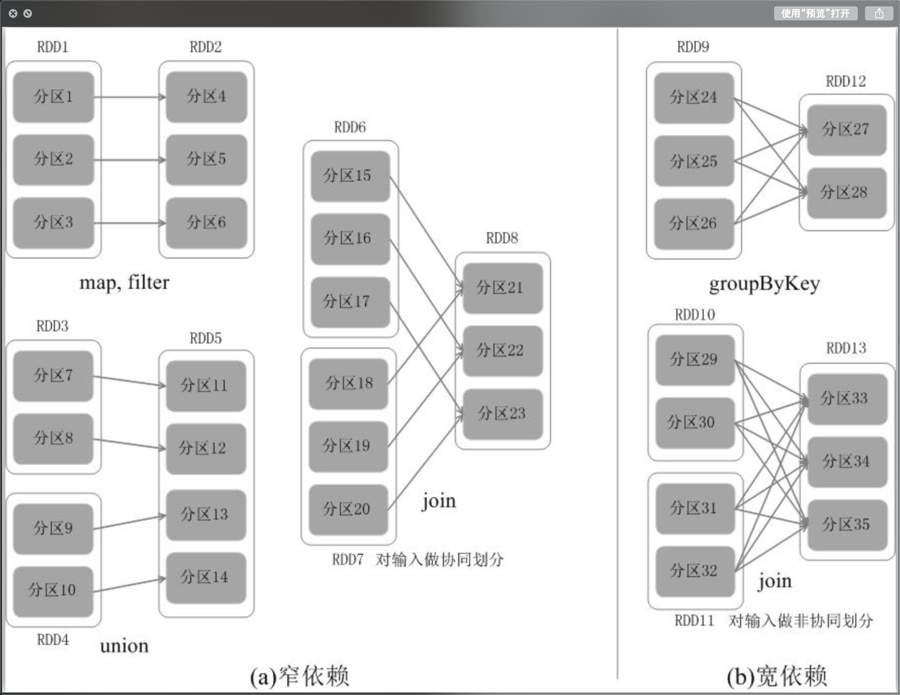
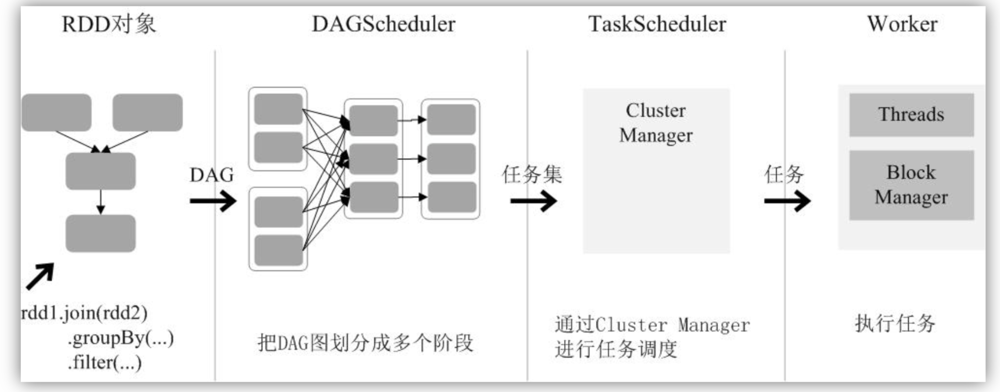

## Spark

RDD尝试通过启用容错分布式内存计算来解决所有问题。RDD是弹性分布式数据集的缩写。RDD是一种分布式内存抽象，它允许程序员以容错的方式在大型集群上执行内存计算。它们是在一组计算机上分区的对象的只读集合，如果分区丢失，可以重建这些对象。在RDD上执行了几个操作：

spark的rdd的算子可以分为两大类：Transformation算子和 Action算子，其中Transformation算子是惰性的，只有rdd触发 Action算子时，才会执行Transformation算子；并且每个Transformation算子都会生成一个Task，每个Action算子都会生成一个job。

两类操作的主要区别是，转换操作（比如map、filter、groupBy、join等）接受RDD并返回RDD，而行动操作（比如count、collect等）接受RDD但是返回非RDD（即输出一个值或结果）
RDD采用了惰性调用，即在RDD的执行过程中（如图9-8所示），真正的计算发生在RDD的“行动”操作，对于“行动”之前的所有“转换”操作，Spark只是记录下“转换”操作应用的一些基础数据集以及RDD生成的轨迹，即相互之间的依赖关系，而不会触发真正的计算。

窄依赖表现为一个父RDD的分区对应于一个子RDD的分区，或多个父RDD的分区对应于一个子RDD的分区
宽依赖则表现为存在一个父RDD的一个分区对应一个子RDD的多个分区
总体而言，如果父RDD的一个分区只被一个子RDD的一个分区所使用就是窄依赖，否则就是宽依赖. 窄依赖典型的操作包括map、filter、union等，宽依赖典型的操作包括groupByKey、sortByKey等。对于连接（join）操作，可以分为两种情况。




在两种依赖关系中，窄依赖的失败恢复更为高效，它只需要根据父RDD分区重新计算丢失的分区即可（不需要重新计算所有分区），而且可以并行地在不同节点进行重新计算。而对于宽依赖而言，单个节点失效通常意味着重新计算过程会涉及多个父RDD分区，开销较大。此外，Spark还提供了数据检查点和记录日志，用于持久化中间RDD，从而使得在进行失败恢复时不需要追溯到最开始的阶段。在进行故障恢复时，Spark会对数据检查点开销和重新计算RDD分区的开销进行比较，从而自动选择最优的恢复策略。


**Transformation 算子**

- parallelize：将Scala的数值和集合创建成RDD。

- makeRDD：将Scala的数值和集合创建成RDD。

- filter：过滤RDD中满足条件的数据。

- map：对RDD数据进行某种逻辑操作。

- sortBy：对RDD的数据进行排序

- union：对两个RDD数据求并集。

- intersection：对两个RDD数据求交集。

- diff：对两个RDD数据求差集。

  注：对RDD进行，并、交和差集时，两个RDD的数据类型必须一致。

- distinct：对RDD数据进行去重

- join：对两个RDD数据进行join(连接)操作。

- leftOuterJoin：对两个RDD数据进行左连接。

- rightOuterJoin：对两个RDD数据进行右连接。
  注：左、右连接操作时，使用"None"带替"null"

- cogroup：对两个RDD数据进行协分布操作。
  注：协分布是将两个RDD集合中数据为"null"的数据使用"CompactBuffer()"代替。

- mapValues：将RDD数据(以"key-value"的形式存储)中Value值进行某种操作。

- groupByKey：将RDD数据(以"key-value"的形式存储)中key值相同的value分配到一组中。

- reduceByKey：将RDD数据(以"key-value"的形式存储)中key值相同的value先局部聚合，在全局聚合。

```python
与groupByKey类似，却有不同。如(a,1), (a,2), (b,1), (b,2)
groupByKey产生中间结果为( (a,1), (a,2) ), ( (b,1), (b,2) )。
而reduceByKey为(a,3), (b,3)。

```


- cartesian：将两个RDD进行笛卡尔积。
- flatMapValues：对RDD中的value值进行flatMap操作。
- combineByKey：该算子是一个底层的算子，他会向将key进行分组，他需要传递三个函数，第一个函数是将分好的key的第一个value取出来进行某种操作；第二个函数是在每个分区中，将value中的其他元素进行某种操作。第三个函数是将每个分区中的数据汇总后，相同的key进行某种操作。并且可以给他传递一
- HashPartition来修改他的分区数量。
- mapPartitions：对一个分区进行map操作，参数是一个迭代器，返回值也是一个迭代器。
- partitionBy：将数据按照指定的分区器进行分区，参数是一个分区器。
- cache：将RDD中的数据存储放到spark的内存中，他与其他的Transformation算子不同，他不会生成新的RDD，而是将调用他的RDD标记，当第一次触发Action算子时，会将该RDD放入到spark的内存中，之后再使用该RDD中的数据时，就直接在内存中读取，速度非常快；当要缓存到内存的数据太大时，调用该方法并且触发Action算子后，会将一部分数据存储到内存中(存储到Executor端)。一旦将数据存储在内存中后，必须使用方法来讲内存中的数据释放掉，或者将该RDD的应用终止。
- unpersist(Boolean)：将内存中的数据释放掉，"true"表示同步释放，"false"表示异步释放。
- checkpint：将spark的中间数据存储到指定的目录中，用于切断RDD的血缘关系，确保RDD数据能够快速恢复。
- setCheckpointDir：指定RDD中间数据存储的目录。

**Action 算子**

- collect：将RDD的结果以数组的形式返回。
- reduce：返回RDD数据进行某种逻辑操作("+"、"-"等)后的结果。
- top(n)：返回RDD中最大的前n个数据(此算子会先将RDD进行降序排列)。
- take(n)：返回RDD中前n个数据。
- first：返回RDD中第一个数据。
- takeOrdered(n)：返回RDD中最小的前n个数据(此算子会先将RDD进行升序排列)。
- count：返回RDD中数据的个数。
- collectAsMap：将RDD的结果以map的形式返还。
- saveAsTextFile：将RDD的结果以Text格式存储到HDFS系统中。
- countByKey：统计RDD中同一key出现的次数，与key的value值无关。
- countByValue：统计RDD中相同数据出现的次数，即key值与value值都相同。
- foreach：将RDD的数据一条一条输出到spark的worker节点管理的Executor中。
- foreachPartition：将RDD的数据一个分区的数据输出到spark的worker节点管理的Executor中。
- aggregate：先局部操作，再全局操作，可以指定初始值，指定的初始值会在每个分区都使用一次，并且也会在最后的全局操作时，在使用一次。
- filterByRange：过滤某个范围的数据，前后都是闭区间。

```python
将初始值和第一个分区中的第一个元素传递给seq函数进行计算，然后将计算结果和
第二个元素传递给seq函数，直到计算到最后一个值。第二个分区中也是同理操作。最后将
初始值、所有分区的结果经过combine函数进行计算（先将前两个结果进行计算，将返回结
果和下一个结果传给combine函数，以此类推），并返回最终结果。

>>> seqOp = (lambda x, y: (x[0] + y, x[1] + 1))
>>> combOp = (lambda x, y: (x[0] + y[0], x[1] + y[1]))
>>> sc.parallelize([1, 2, 3, 4]).aggregate((0, 0), seqOp, combOp)
(10, 4)
>>> sc.parallelize([]).aggregate((0, 0), seqOp, combOp)
(0, 0)

```

RDD运行过程 
通过上述对RDD概念、依赖关系和阶段划分的介绍，结合之前介绍的Spark运行基本流程，这里再总结一下RDD在Spark架构中的运行过程（如图9-12所示）：
（1）创建RDD对象；
（2）SparkContext负责计算RDD之间的依赖关系，构建DAG；
（3）DAGScheduler负责把DAG图分解成多个阶段，每个阶段中包含了多个任务，每个任务会被任务调度器分发给各个工作节点（Worker Node）上的Executor去执行。



Spark应用转换流程
1、 spark应用提交后，经历了一系列的转换，最后成为task在每个节点上执行
2、 RDD的Action算子触发Job的提交，生成RDD DAG
3、 由DAGScheduler将RDD DAG转化为Stage DAG，每个Stage中产生相应的Task集合
4、 TaskScheduler将任务分发到Executor执行
5、 每个任务对应相应的一个数据块，只用用户定义的函数处理数据块


**Spark任务优化**
1 内存调优
2 高性能算子
任务是同一个用户的行为数据，分布式处理需要把一个用户的数据抓取到一个节点上处理，有Shuffle操作，如下图所示同源数据采用groupByKey时Shuffle Write数据量3.5T，aggregateByKey时Shuffle Write数据量3T，相比节省时间2~3min。
分析数据分布的特征，同一个设备的数据一般在一个文件出现的概率较大，将groupByKey算子改成 aggregateByKey，首先进行了一个Map端的聚合，减少了网络传输的数据量。
3 数据结构优化
任务代码中，采用更加节省内存的数据结构，例如聚合的key、最短路径中的索引（如下模拟代码所示）等多处采用字符串拼接实现，避免自定义对象封装数据，尽可能使用轻量的Array而不是HashMap等
效果：节省内存。
4 广播大变量和小表调优
任务过程需要关联一些小的维表或定义一些大的变量，并存在大量task，所以需要广播。
效果（1）降低网络传输的数据量；（2）降低内存的使用；（3）加快程序的运行速度。
通过如上四种Spark任务优化，使任务运行更加稳定，同时也节省了内存。


**RDD中reduceBykey与groupByKey哪个性能好，为什么**

reduceByKey：reduceByKey会在结果发送至reducer之前会对每个mapper在本地进行merge，有点类似于在MapReduce中的combiner。这样做的好处在于，在map端进行一次reduce之后，数据量会大幅度减小，从而减小传输，保证reduce端能够更快的进行结果计算。
groupByKey：groupByKey会对每一个RDD中的value值进行聚合形成一个序列(Iterator)，此操作发生在reduce端，所以势必会将所有的数据通过网络进行传输，造成不必要的浪费。同时如果数据量十分大，可能还会造成OutOfMemoryError。
通过以上对比可以发现在进行大量数据的reduce操作时候建议使用reduceByKey。不仅可以提高速度，还是可以防止使用groupByKey造成的内存溢出问题。

### 参考资料

http://dblab.xmu.edu.cn/blog/1681-2/