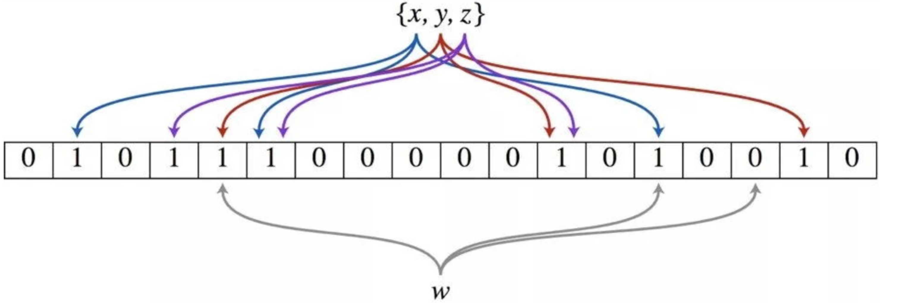

## 大数据算法问题
快速查找 1 个数字是否在 1 亿个不相同的数字中： BitMap，1 个字节表示 8 个整数是否出现，1 亿个约需 12.5M 空间，时间复杂度 O(n)+O(1)
因此，当 N 为 1 亿的时候需要 12MB 的存储空间。当 N 为 10 亿的时候需要 120MB 的存储空间了。当 N 的数量大到一定量级的时候，比如 N 为 2^64 这个海量级别的时候，需要消耗 2048PB 的存储空间，这个量级的BitMap，目前硬件上是支持不了的。
也就是说：位图法的所占空间随集合内最大元素的增大而增大。这就会带来一个问题，如果查找的元素数量少但其中某个元素的值很大，比如数字范围是 1 到 1000 亿，那消耗的空间不容乐观。
这个就是位图的一个不容忽视的缺点：空间复杂度随集合内最大元素增大而线性增大。对于开头的题目而言，使用位图进行处理，实际上内存消耗也是不少的。
因此，出于性能和内存占用的考虑，在这里使用布隆过滤器才是最好的解决方案：布隆过滤器是对位图的一种改进。

布隆过滤器除了一个位数组，还有 K 个哈希函数。当一个元素加入布隆过滤器中的时候，会进行如下操作：
使用 K 个哈希函数对元素值进行 K 次计算，得到 K 个哈希值。
根据得到的哈希值，在位数组中把对应下标的值置为 1。
当要判断一个值是否在布隆过滤器中，对元素进行三次哈希计算，得到值之后判断位数组中的每个元素是否都为 1，如果值都为 1，那么说明这个值在布隆过滤器中，如果存在一个值不为 1，说明该元素不在布隆过滤器中。

这就是布隆过滤器的一个缺陷：存在误判。
但是，如果布隆过滤器判断某个元素不在布隆过滤器中，那么这个值就一定不在布隆过滤器中。总结就是：
布隆过滤器说某个元素在，可能会被误判
布隆过滤器说某个元素不在，那么一定不在

两文件各存放 50 亿个 url，找出相同 url： Hash(url)%1000，将 a、b 两文件各切分成 1000 个小文件。相同的 url 其 hash 值一定相同， 分别扫描 1000 对文件找到相同的 url。遍历 a0 将 url 存放到 HashMap 中，然后遍历 b0， 如果 url 在 HashMap 中就保存。 如果允许一定错误率，用 bloom filter。

海量日志数据，找到访问次数最多的 IP： 按照 IP 进行 Hash，分到 1024 个小文件中；统计每个文件中频率最高的 IP，再对 1024 个 IP 排序。

重复度很高的海量字段，统计频率最高的 10 个：用 hash 表统计每个字段频率，再用堆找出 top 10。

找出 1 亿个数字中不重复的数字： 用 2bitmap，00 不存在 01 出现一次 10 出现多次，输出对应位是 01 的数。(int 4字节，32bit)