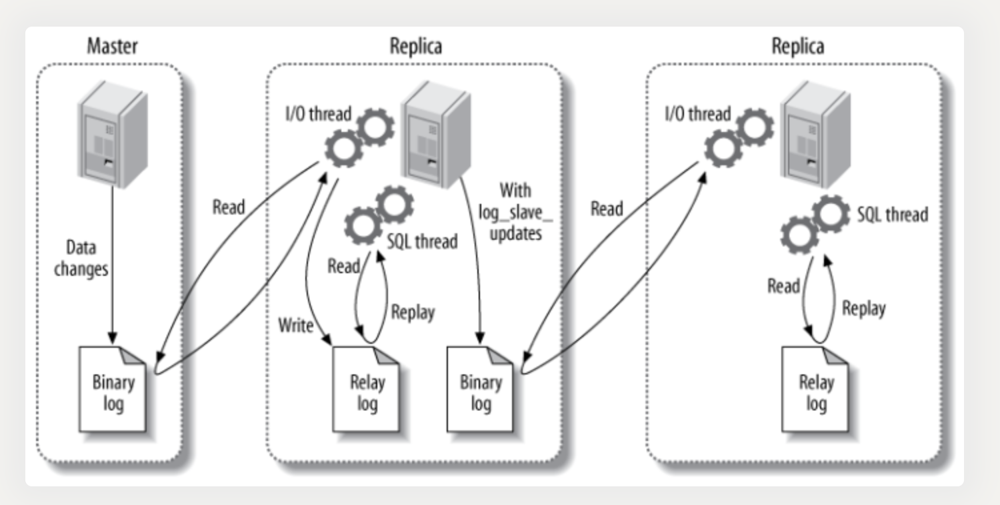

# MySQL
## B+ Tree 原理
B+ Tree 是基于 B Tree 和叶子节点顺序访问指针进行实现，它具有 B Tree 的平衡性，并且通过顺序访问指针来提高区间查询的性能。

在 B+ Tree 中，一个节点中的 key 从左到右非递减排列，如果某个指针的左右相邻 key 分别是 keyi 和 keyi+1，且不为 null，则该指针指向节点的所有 key 大于等于 keyi 且小于等于 keyi+1。

进行查找操作时，首先在根节点进行二分查找，找到一个 key 所在的指针，然后递归地在指针所指向的节点进行查找。直到查找到叶子节点，然后在叶子节点上进行二分查找，找出 key 所对应的 data。

插入删除操作会破坏平衡树的平衡性，因此在插入删除操作之后，需要对树进行一个分裂、合并、旋转等操作来维护平衡性。

3. 与红黑树的比较
红黑树等平衡树也可以用来实现索引，但是文件系统及数据库系统普遍采用 B+ Tree 作为索引结构，主要有以下两个原因：

（一）更少的查找次数

平衡树查找操作的时间复杂度和树高 h 相关，O(h)=O(logdN)，其中 d 为每个节点的出度。
红黑树的出度为 2，而 B+ Tree 的出度一般都非常大，所以红黑树的树高 h 很明显比 B+ Tree 大非常多，查找的次数也就更多。

（二）利用磁盘预读特性

为了减少磁盘 I/O 操作，磁盘往往不是严格按需读取，而是每次都会预读。预读过程中，磁盘进行顺序读取，顺序读取不需要进行磁盘寻道，并且只需要很短的磁盘旋转时间，速度会非常快。
操作系统一般将内存和磁盘分割成固定大小的块，每一块称为一页，内存与磁盘以页为单位交换数据。数据库系统将索引的一个节点的大小设置为页的大小，使得一次 I/O 就能完全载入一个节点。并且可以利用预读特性，相邻的节点也能够被预先载入。

MySQL 索引
1. B+Tree 索引
2. 哈希索引：哈希索引能以 O(1) 时间进行查找，但是失去了有序性
3. 全文索引：MyISAM 存储引擎支持全文索引，用于查找文本中的关键词
4. 空间数据索引

索引的优点
- 大大减少了服务器需要扫描的数据行数。
- 帮助服务器避免进行排序和分组，以及避免创建临时表（B+Tree 索引是有序的，可以用于 ORDER BY 和 GROUP BY 操作。临时表主要是在排序和分组过程中创建，不需要排序和分组，也就不需要创建临时表）。
- 将随机 I/O 变为顺序 I/O（B+Tree 索引是有序的，会将相邻的数据都存储在一起）。

**为什么 MySQL 使用 B+Tree 结构实现索引：**

- 对于数据存储在磁盘中的数据库系统而言，I/O 操作次数是影响性能的重要因素
- 操作系统是按页（getconf PAGESIZE，默认 4K）读取磁盘中数据，一次读取一页数据
- 如果读取的数据量超过一页大小，会触发多次 I/O 操作, 若 M 的取值让每个节点大小等于页大小，这时读取一个节点只需要一次磁盘 I/O 操作
- B+Tree 的非叶子结点只保存关键字和指向子结点的指针，相同的页大小可以存储更多的节点数，同时减少了树的高度增加了树的分叉数，进而减少了磁盘 I/O 操作次数
- 删除数据时更简单，因为 B+Tree 实际数据只保存在叶子结点，所以不需要删除非叶子结点

## 存储引擎
InnoDB： 是 MySQL 默认的事务型存储引擎，只有在需要它不支持的特性时，才考虑使用其它存储引擎。
MyISAM：提供了大量的特性，包括压缩表、空间数据索引等。
**比较**
事务：InnoDB 是事务型的，可以使用 Commit 和 Rollback 语句。
并发：MyISAM 只支持表级锁，而 InnoDB 还支持行级锁。
外键：InnoDB 支持外键。
备份：InnoDB 支持在线热备份。
崩溃恢复：MyISAM 崩溃后发生损坏的概率比 InnoDB 高很多，而且恢复的速度也更慢。
其它特性：MyISAM 支持压缩表和空间数据索引。

水平切分
水平切分又称为 Sharding，它是将同一个表中的记录拆分到多个结构相同的表中。
当一个表的数据不断增多时，Sharding 是必然的选择，它可以将数据分布到集群的不同节点上，从而缓存单个数据库的压力。

Sharding 策略
哈希取模：hash(key) % N；
范围：可以是 ID 范围也可以是时间范围；
映射表：使用单独的一个数据库来存储映射关系

主从复制
主要涉及三个线程：binlog 线程、I/O 线程和 SQL 线程。
binlog 线程 ：负责将主服务器上的数据更改写入二进制日志（Binary log）中。
I/O 线程 ：负责从主服务器上读取二进制日志，并写入从服务器的中继日志（Relay log）。
SQL 线程 ：负责读取中继日志，解析出主服务器已经执行的数据更改并在从服务器中重放（Replay）。
