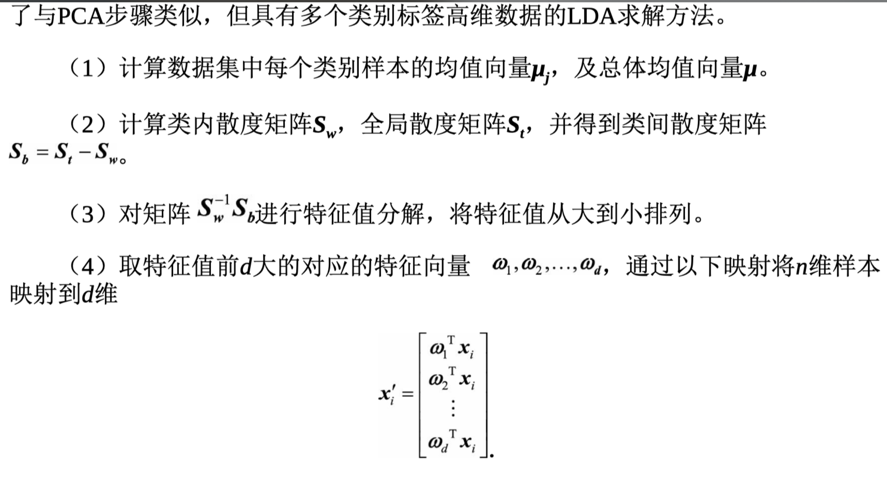
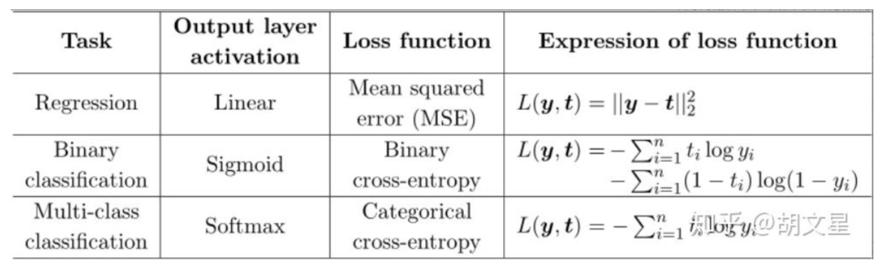

## LDA & PCA

LDA的原理是，将带上标签的数据（点），通过投影的方法，投影到维度更低的空间中，使得投影后的点，会形成按类别区分，一簇一簇的情况，相同类别的点，将会在投影后的空间中更接近。要说明白LDA，首先得弄明白线性分类器(Linear Classifier)：因为LDA是一种线性分类器

分类的目标是，使得类别内的点距离越近越好（集中），类别间的点越远越好

主成分分析（PCA）与LDA有着非常近似的意思，LDA的输入数据是带标签的，而PCA的输入数据是不带标签的，所以PCA是一种unsupervised learning。LDA通常来说是作为一个独立的算法存在，给定了训练数据后，将会得到一系列的判别函数（discriminate function），之后对于新的输入，就可以进行预测了。而PCA更像是一个预处理的方法，它可以将原本的数据降低维度，而使得降低了维度的数据之间的方差最大

PCA 是无监督的，它所作的只是将整组数据整体映射到最方便表示这组数据的坐标轴上，映射时没有利用任何数据内部的分类信息 用主要的特征代替其他相关的非主要的特征，所有特征之间的相关度越高越好

西瓜书上将此俩个结论归纳为最大可分析和最近重构性。其中最大可分性可以理解为我们希望降维过后的数据不影响后续我们对其的分类处理，其数据特征的差异性仍然足够强，也即方差最大；最近重构性可以理解为我们希望降维过后的数据仍然保留有其主要的特征，也即数据样本点到这个超平面的距离和最小

总结一下，我们就可以梳理出整一个PCA降维的流程，归纳如下，
 （1）样本中心化
 （2）计算样本的协方差矩阵
 （3）对协方差矩阵做特征值分解
 （4）取最大的  个特征值所对应的特征向量
 （5）计算投影矩阵
至此，已经讲述清晰PCA与LDA的理论概念及其推导过程，从过程来看，他们有着很大的相似性，最后其实都是求某一个矩阵的特征值，投影矩阵即为该特征值对应的特征向量。但是其原理也稍有不同，现总结如下。

1. PCA为非监督降维，LDA为有监督降维
2. PCA希望投影后的数据方差尽可能的大（最大可分性），因为其假设方差越多，则所包含的信息越多；而LDA则希望投影后相同类别的组内方差小，而组间方差大。LDA能合理运用标签信息，使得投影后的维度具有判别性，不同类别的数据尽可能的分开。

举个简单的例子，在语音识别领域，如果单纯用PCA降维，则可能功能仅仅是过滤掉了噪声，还是无法很好的区别人声，但如果有标签识别，用LDA进行降维，则降维后的数据会使得每个人的声音都具有可分性，同样的原理也适用于脸部特征识别。

数据分布得更为分散，这也意味着数据在这个方向上方差更大。在信 号处理领域，我们认为信号具有较大方差，噪声具有较小方差，信号与噪声之比 称为信噪比。信噪比越大意味着数据的质量越好，反之，信噪比越小意味着数据 的质量越差。由此我们不难引出PCA的目标，即最大化投影方差，也就是让数据 在主轴上投影的方差最大。
熟悉线性代数的读者马上就会发现，原来，x投影后的方差就是协方差矩阵的 特征值。我们要找到最大的方差也就是协方差矩阵最大的特征值，最佳投影方向 就是最大特征值所对应的特征向量。次佳投影方向位于最佳投影方向的正交空间 中，是第二大特征值对应的特征向量，以此类推

（1）对样本数据进行中心化处理。

（2）求样本协方差矩阵。

（3）对协方差矩阵进行特征值分解，将特征值从大到小排列。

（4）取特征值前d大对应的特征向量ω1 ,ω2 ,...,ωd ，通过以下映射将n维样本映 射到d维

假设用不同的颜色标注C 1 、C 2 两个不同类别的数据，如图4.4所示。根据PCA 算法，数据应该映射到方差最大的那个方向，亦即y轴方向。但是，C1 ，C2 两个不 同类别的数据就会完全混合在一起，很难区分开。所以，使用PCA算法进行降维 后再进行分类的效果会非常差。但是，如果使用LDA算法，数据会映射到x轴方 向。那么，LDA算法究竟是如何做到这一点的呢？

LDA的中心思想——最大化类间距离和最小化类内距 离。

###  LR和SVM的不同 

深入了解了LR和SVM的原理过后，会发现影响SVM决策面的样本点只有少数的结构支持向量，当在支持向量外添加或减少任何样本点对分类决策面没有任何影响；而在LR中，每个样本点都会影响决策面的结果. 因为上面的原因，得知：线性SVM不直接依赖于数据分布，分类平面不受一类点影响；LR则受所有数据点的影响，如果数据不同类别strongly unbalance，一般需要先对数据做balancing

第一，本质上是其loss function不同 （SVM: Hinge损失函数, LR: 交叉熵作为损失函数）

$$hinge 损失：l_{hinge}(z)=max(0, 1-z)$$

如果用的是均方差作为损失函数，求得的梯度受到simoid函数导数的影响, 损失函数收敛的很慢
第二，支持向量机只考虑局部的边界线附近的点，而逻辑回归考虑全局（远离的点对边界线的确定也起作用）
第三，在解决非线性问题时，支持向量机采用核函数的机制，而LR通常不采用核函数的方法。
第四，线性SVM依赖数据表达的距离测度，所以需要对数据先做normalization，LR不受其影响
第五，SVM的损失函数就自带正则！！！（损失函数中的1/2||w||^2项），这就是为什么SVM是结构风险最小化算法的原因！！！而LR必须另外在损失函数上添加正则项！！！

当使用sigmoid作为激活函数的时候，常用交叉熵损失函数而不用均方误差损失函数，因为它可以完美解决平方损失函数权重更新过慢的问题，具有“误差大的时候，权重更新快；误差小的时候，权重更新慢”的良好性质。

###  参考资料

https://www.cnblogs.com/zhizhan/p/5038747.html

https://zhuanlan.zhihu.com/p/58883095