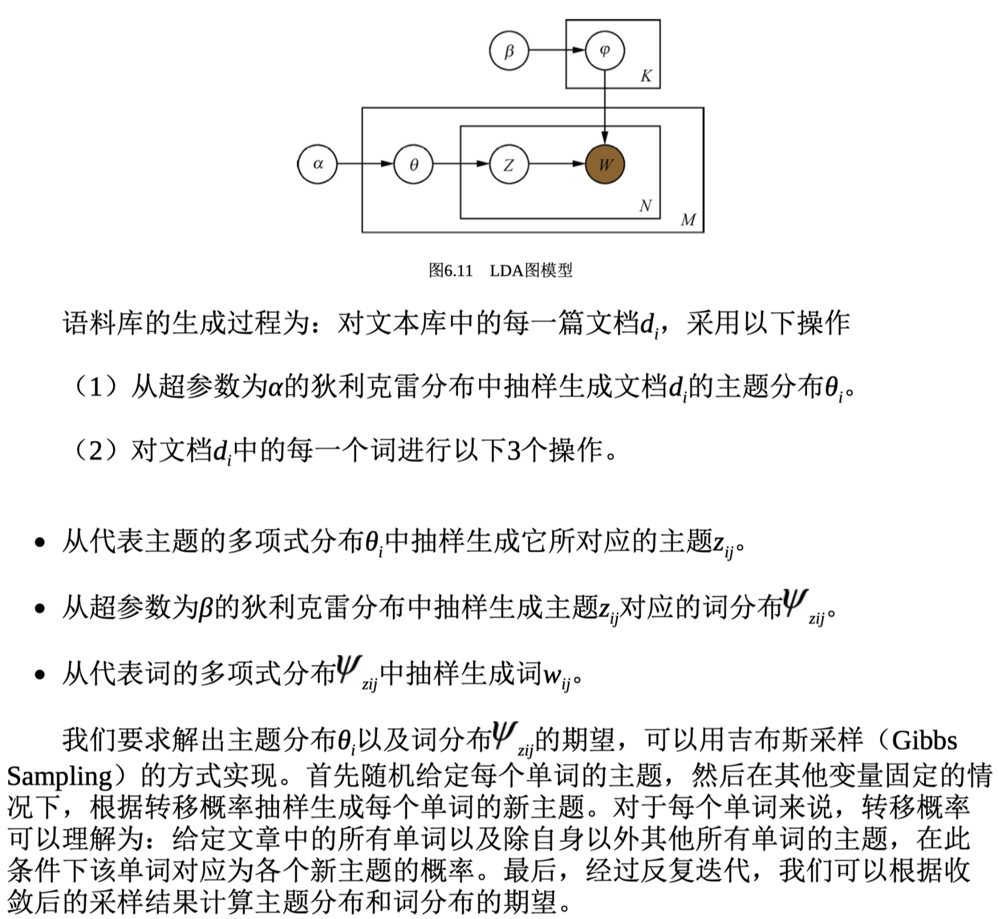

## 主题模型

LDA可以看作是pLSA的贝叶斯版本，其文本生成过程与pLSA基本相同，不同 的是为主题分布和词分布分别加了两个狄利克雷（Dirichlet）先验

在LDA中，主题的个数K是一个预先指定的超参数。对于模型超参数的选择， 实践中的做法一般是将全部数据集分成训练集、验证集、和测试集3部分，然后利 用验证集对超参数进行选择。例如，在确定LDA的主题个数时，我们可以随机选 取60%的文档组成训练集，另外20%的文档组成验证集，剩下20%的文档组成测试集。在训练时，尝试多组超参数的取值，并在验证集上检验哪一组超参数所对应 的模型取得了最好的效果。最终，在验证集上效果最好的一组超参数和其对应的 模型将被选定，并在测试集上进行测试。
为了衡量LDA模型在验证集和测试集上的效果，需要寻找一个合适的评估指 标。一个常用的评估指标是困惑度（perplexity）。

一开始，随着主题个数的增多，模型在训练集和验证集的困惑度呈下降趋 势，但是当主题数目足够大的时候，会出现过拟合，导致困惑度指标在训练集上 继续下降但在验证集上反而增长。这时，可以取验证集的困惑度极小值点所对应 的主题个数作为超参数。在实践中，困惑度的极小值点可能出现在主题数目非常 大的时候，然而实际应用并不能承受如此大的主题数目，这时就需要在实际应用 中合理的主题数目范围内进行选择，比如选择合理范围内困惑度的下降明显变慢 （拐点）的时候。

另外一种方法是在LDA基础之上融入分层狄利克雷过程（Hierarchical Dirichlet Process，HDP），构成一种非参数主题模型HDP-LDA。非参数主题模型的好处是 不需要预先指定主题的个数，模型可以随着文档数目的变化而自动对主题个数进 行调整；它的缺点是在LDA基础上融入HDP之后使得整个概率图模型更加复杂， 训练速度也更加缓慢，因此在实际应用中还是经常采用第一种方法确定合适的主 题数目。

**如何用主题模型解决推荐系统中的冷启动问题**
用户冷启动是指对一个之前没有行为或行为极少的新用 户进行推荐；物品冷启动是指为一个新上市的商品或电影（这时没有与之相关的 评分或用户行为数据）寻找到具有潜在兴趣的用户；系统冷启动是指如何为一个 新开发的网站设计个性化推荐系统。
可以使用主题模型（pLSA、LDA等）得到用户和电影的主 题。以用户为例，我们将每个用户看作主题模型中的一篇文档，用户对应的特征 作为文档中的单词，这样每个用户可以表示成一袋子特征的形式。通过主题模型 学习之后，经常共同出现的特征将会对应同一个主题，同时每个用户也会相应地 得到一个主题分布。每个电影的主题分布也可以用类似的方法得到。