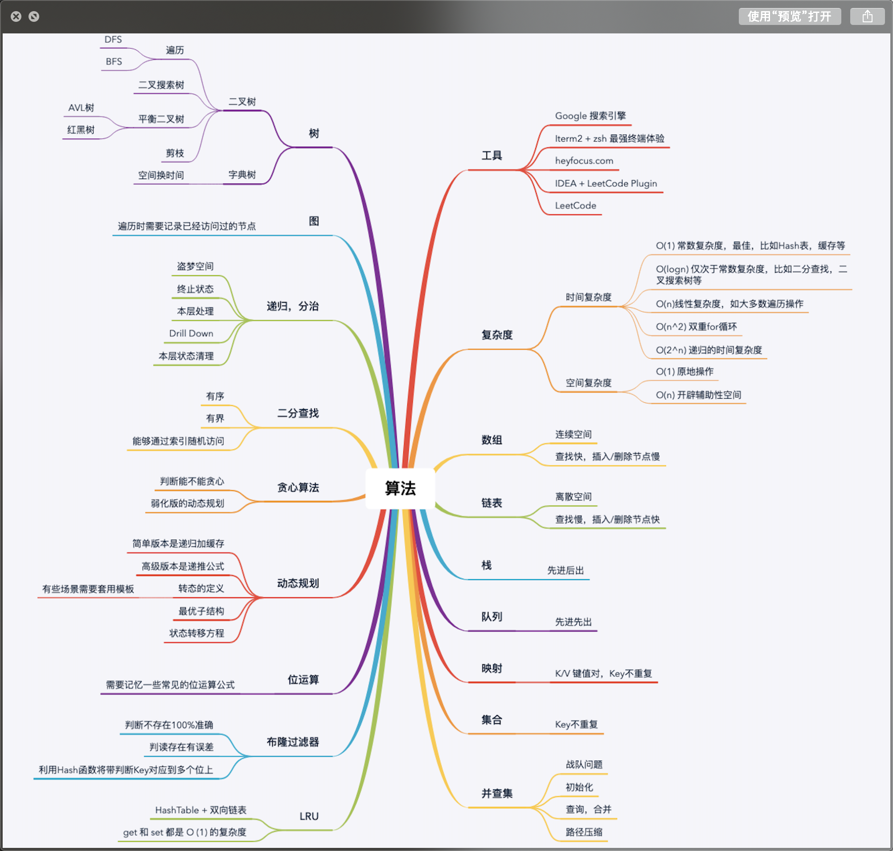
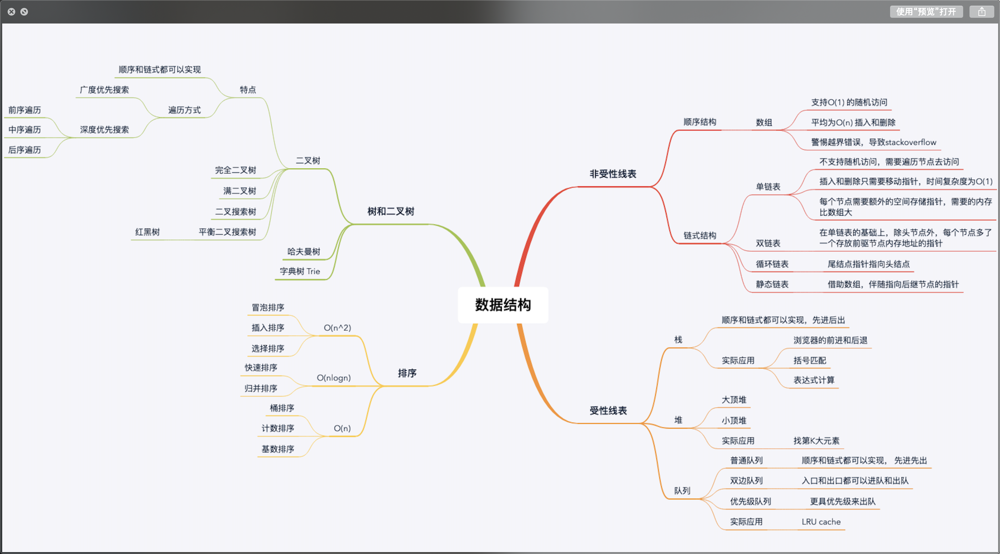
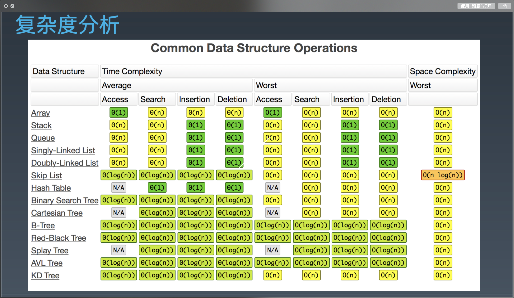

## 算法和数据结构脑图

1.职业训练:拆分知识点、可以练习、反馈

如果想要精通一个领域：分为三步走

- Chunk it up 切碎知识点
- Deliberate Practicing 刻意练习
- Feedback 反馈（分为主动式反馈和被动式反馈）

2）刻意练习

职业化运动：

- 基本功是区分业余和职业选手的根本
- 基础动作的分解训练和反复练习--最大误区
- 刻意练习-过遍数（五毒神掌）
- 练习缺陷、弱点的地方，可能会不舒服、不爽、枯燥，但是说明在成长。
- 生活中的例子：乒乓球、台球、游戏。

切题四件套：

- Clarification （审题）
- Possible solution（解题多种可能性）
- compare(time/space)
- optimal(加强)
- Coding（多写）
- Test cases（测试）

3）主动学习，有大佬给codeReview

2.五步刷题法（五毒神掌）

第一遍：

5分钟：读题+思考（不要超过15分钟）

直接看解法:注意！多解法，比较优劣

背诵、默写好的解法

第二遍：

马上自己写--> LeetCode提交

多种解法比较、体会-->优化！

第三遍：

过了一天后，再重复做题

不同解法的熟练程度-->专项练习

第四遍：

过了一周：反复回来练习相同题目

对于不熟的题目专项练习。

第五遍：

如果有面试，面试前一周进行恢复式训练

### 算法脑图

### 数据结构脑图

### 算法复杂度

