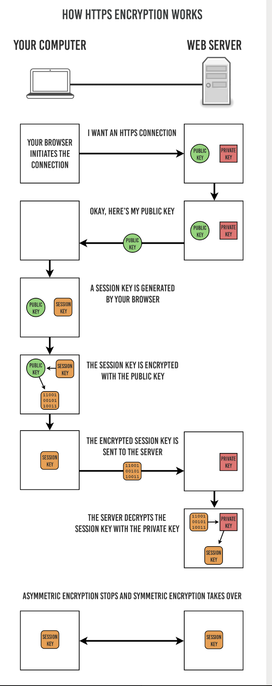
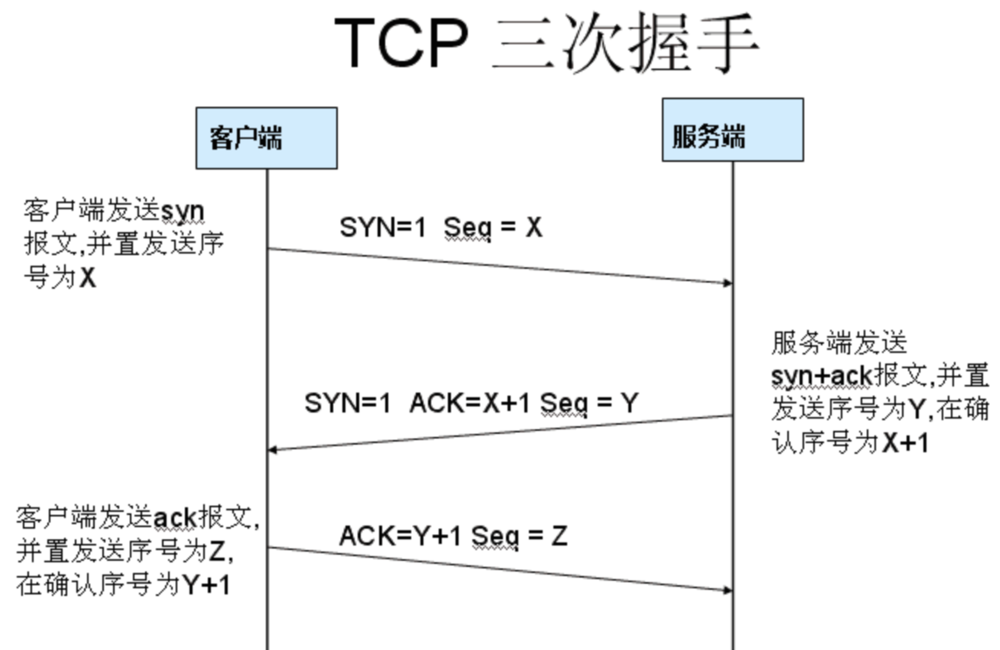

# Http & Https

**HTTP和HTTPS的区别**

1、https协议需要到CA  （Certificate Authority，证书颁发机构）申请证书，一般免费证书较少，因而需要一定费用。(原来网易官网是http，而网易邮箱是https。)
2、http是超文本传输协议，信息是明文传输，https则是具有安全性的ssl加密传输协议。
3、http和https使用的是完全不同的连接方式，用的端口也不一样，前者是80，后者是443。
4、http的连接很简单，是无状态的。Https协议是由SSL+Http协议构建的可进行加密传输、身份认证的网络协议，比http协议安全。(无状态的意思是其数据包的发送、传输和接收都是相互独立的。无连接的意思是指通信双方都不长久的维持对方的任何信息。)

HTTPS 采用的加密方式

- 使用非对称密钥加密方式，传输对称密钥加密方式所需要的 Secret Key，从而保证安全性;
- 获取到 Secret Key 后，再使用对称密钥加密方式进行通信，从而保证效率。（下图中的 Session Key 就是 Secret Key）

  

认证
通过使用 证书 来对通信方进行认证。
数字证书认证机构（CA，Certificate Authority）是客户端与服务器双方都可信赖的第三方机构。
服务器的运营人员向 CA 提出公开密钥的申请，CA 在判明提出申请者的身份之后，会对已申请的公开密钥做数字签名，然后分配这个已签名的公开密钥，并将该公开密钥放入公开密钥证书后绑定在一起。
进行 HTTPS 通信时，服务器会把证书发送给客户端。客户端取得其中的公开密钥之后，先使用数字签名进行验证，如果验证通过，就可以开始通信了。

HTTPS 的报文摘要功能之所以安全，是因为它结合了加密和认证这两个操作。试想一下，加密之后的报文，遭到篡改之后，也很难重新计算报文摘要，因为无法轻易获取明文。

HTTPS 的缺点
因为需要进行加密解密等过程，因此速度会更慢；
需要支付证书授权的高额费用

**加密算法**

主要使用的加密算法有摘要算法、对称加密算法和非对称加密算法
常用的摘要算法有MD5,SHA1。摘要算法是一个不可逆过程，就是无论多大数据，经过算法运算后都是生成固定长度的数据,一般结果使用16进制进行显示。

MD5结果是128位摘要，SHa1是160位摘要。那么MD5的速度更快，而SHA1的强度更高。

**HTTP常见的请求方式及主要操作**

最直观的区别就是GET把参数包含在URL中，POST通过request body传递参数。

GET产生一个TCP数据包；POST产生两个TCP数据包。

对于GET方式的请求，浏览器会把http header和data一并发送出去，服务器响应200（返回数据）；

而对于POST，浏览器先发送header，服务器响应100 continue，浏览器再发送data，服务器响应200 ok（返回数据）。

- GET在浏览器回退时是无害的，而POST会再次提交请求。
- GET产生的URL地址可以被Bookmark，而POST不可以。
- GET请求会被浏览器主动cache，而POST不会，除非手动设置。
- GET请求只能进行url编码，而POST支持多种编码方式。
- GET请求参数会被完整保留在浏览器历史记录里，而POST中的参数不会被保留。
- GET请求在URL中传送的参数是有长度限制的，而POST么有。
- 对参数的数据类型，GET只接受ASCII字符，而POST没有限制。
- GET比POST更不安全，因为参数直接暴露在URL上，所以不能用来传递敏感信息。
- GET参数通过URL传递，POST放在Request body中

**TCP的三次握手是什么**

