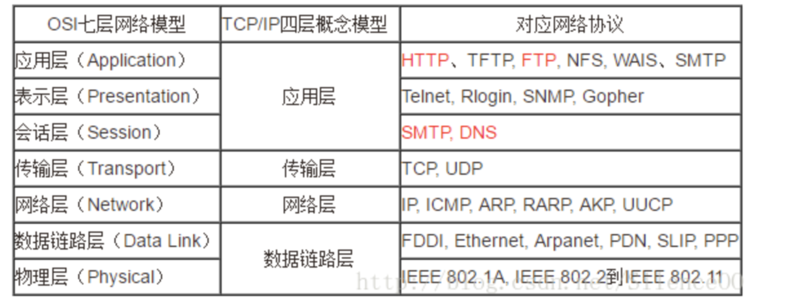
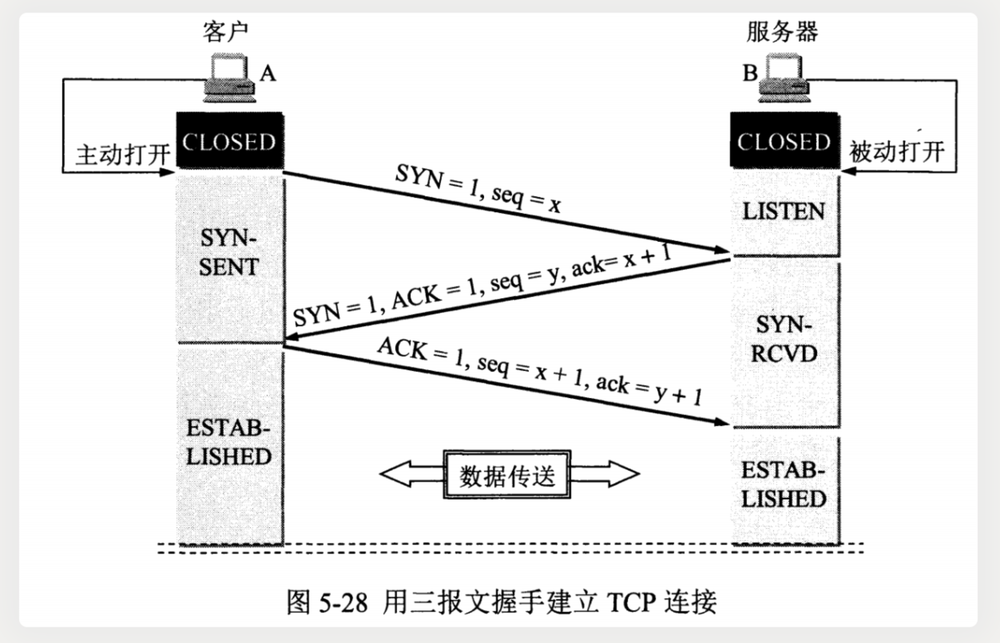
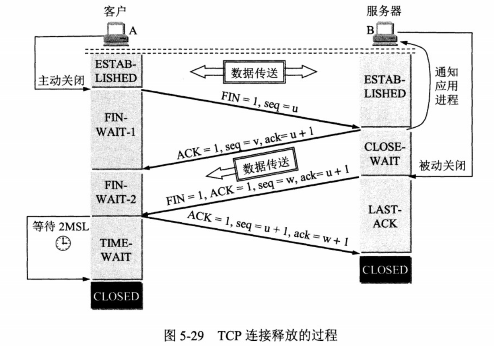
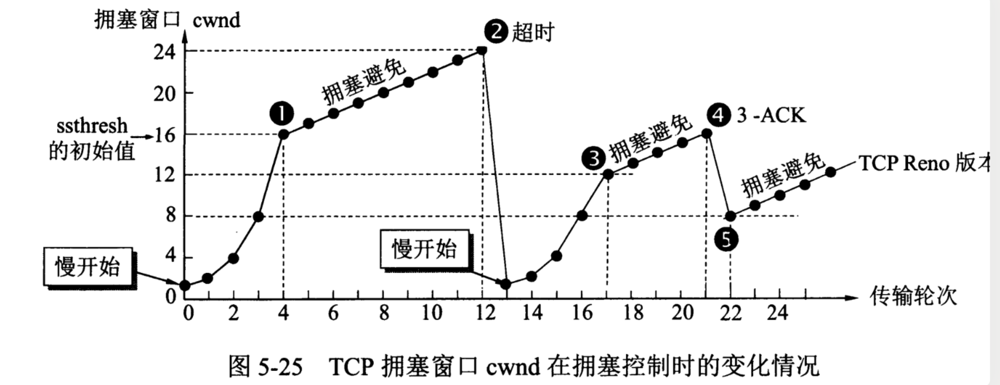
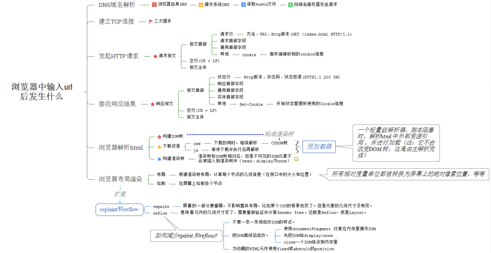

# 计算机网络

### 五层协议

应用层 ：为特定应用程序提供数据传输服务，例如 HTTP、DNS 等协议。数据单位为报文。

传输层 ：为进程提供通用数据传输服务。由于应用层协议很多，定义通用的传输层协议就可以支持不断增多的应用层协议。运输层包括两种协议：传输控制协议 TCP，提供面向连接、可靠的数据传输服务，数据单位为报文段；用户数据报协议 UDP，提供无连接、尽最大努力的数据传输服务，数据单位为用户数据报。TCP 主要提供完整性服务，UDP 主要提供及时性服务。

网络层 ：为主机提供数据传输服务。而传输层协议是为主机中的进程提供数据传输服务。网络层把传输层传递下来的报文段或者用户数据报封装成分组。

数据链路层 ：网络层针对的还是主机之间的数据传输服务，而主机之间可以有很多链路，链路层协议就是为同一链路的主机提供数据传输服务。数据链路层把网络层传下来的分组封装成帧。

物理层 ：考虑的是怎样在传输媒体上传输数据比特流，而不是指具体的传输媒体。物理层的作用是尽可能屏蔽传输媒体和通信手段的差异，使数据链路层感觉不到这些差异

## 数据链路层
循环冗余检验（CRC）来检查比特差错
主要有两种控制方法进行协调，一个是使用信道复用技术，一是使用 CSMA/CD 协议。

信道复用技术
1. 频分复用
2. 时分复用

CSMA/CD 表示载波监听多点接入 / 碰撞检测。

多点接入 ：说明这是总线型网络，许多主机以多点的方式连接到总线上。
载波监听 ：每个主机都必须不停地监听信道。在发送前，如果监听到信道正在使用，就必须等待。
碰撞检测 ：在发送中，如果监听到信道已有其它主机正在发送数据，就表示发生了碰撞。虽然每个主机在发送数据之前都已经监听到信道为空闲，但是由于电磁波的传播时延的存在，还是有可能会发生碰撞。
记端到端的传播时延为 τ，最先发送的站点最多经过 2τ 就可以知道是否发生了碰撞，称 2τ 为 争用期 。只有经过争用期之后还没有检测到碰撞，才能肯定这次发送不会发生碰撞。

当发生碰撞时，站点要停止发送，等待一段时间再发送。这个时间采用 截断二进制指数退避算法 来确定。从离散的整数集合 `{0, 1, .., (2k-1)}` 中随机取出一个数，记作 r，然后取 r 倍的争用期作为重传等待时间。

MAC 地址是链路层地址，长度为 6 字节（48 位），用于唯一标识网络适配器（网卡）。
一台主机拥有多少个网络适配器就有多少个 MAC 地址。例如笔记本电脑普遍存在无线网络适配器和有线网络适配器，因此就有两个 MAC 地址。

**地址解析协议 ARP**
ARP 实现由 IP 地址得到 MAC 地址。

ICMP 是为了更有效地转发 IP 数据报和提高交付成功的机会。它封装在 IP 数据报中，但是不属于高层协议。
Ping 是 ICMP 的一个重要应用，主要用来测试两台主机之间的连通性。
Ping 的原理是通过向目的主机发送 ICMP Echo 请求报文，目的主机收到之后会发送 Echo 回答报文。Ping 会根据时间和成功响应的次数估算出数据包往返时间以及丢包率。

Traceroute 是 ICMP 的另一个应用，用来跟踪一个分组从源点到终点的路径。
Traceroute 发送的 IP 数据报封装的是无法交付的 UDP 用户数据报，并由目的主机发送终点不可达差错报告报文。

网络地址转换 NAT：专用网内部的主机使用本地 IP 地址又想和互联网上的主机通信时，可以使用 NAT 来将本地 IP 转换为全球 IP

可以把路由选择协议划分为两大类：
自治系统内部的路由选择：RIP 和 OSPF
自治系统间的路由选择：BGP

UDP 和 TCP 的特点
用户数据报协议 UDP（User Datagram Protocol）是无连接的，尽最大可能交付，没有拥塞控制，面向报文（对于应用程序传下来的报文不合并也不拆分，只是添加 UDP 首部），支持一对一、一对多、多对一和多对多的交互通信。

传输控制协议 TCP（Transmission Control Protocol）是面向连接的，提供可靠交付，有流量控制，拥塞控制，提供全双工通信，面向字节流（把应用层传下来的报文看成字节流，把字节流组织成大小不等的数据块），每一条 TCP 连接只能是点对点的（一对一)

TCP 的三次握手

**三次握手的原因**

第三次握手是为了防止失效的连接请求到达服务器，让服务器错误打开连接。

客户端发送的连接请求如果在网络中滞留，那么就会隔很长一段时间才能收到服务器端发回的连接确认。客户端等待一个超时重传时间之后，就会重新请求连接。但是这个滞留的连接请求最后还是会到达服务器，如果不进行三次握手，那么服务器就会打开两个连接。如果有第三次握手，客户端会忽略服务器之后发送的对滞留连接请求的连接确认，不进行第三次握手，因此就不会再次打开连接。

**TCP 的四次挥手**

A 发送连接释放报文，FIN=1。
B 收到之后发出确认，此时 TCP 属于半关闭状态，B 能向 A 发送数据但是 A 不能向 B 发送数据。
当 B 不再需要连接时，发送连接释放报文，FIN=1。
A 收到后发出确认，进入 TIME-WAIT 状态，等待 2 MSL（最大报文存活时间）后释放连接。
B 收到 A 的确认后释放连接。
**四次挥手的原因**
客户端发送了 FIN 连接释放报文之后，服务器收到了这个报文，就进入了 CLOSE-WAIT 状态。这个状态是为了让服务器端接受还未传送完毕的数据，传送完毕之后，服务器会发送 FIN 连接释放报文。

**TCP 流量控制**
流量控制是为了控制发送方发送速率，保证接收方来得及接收。
接收方发送的确认报文中的窗口字段可以用来控制发送方窗口大小，从而影响发送方的发送速率。将窗口字段设置为 0，则发送方不能发送数据。

**TCP 拥塞控制**
如果网络出现拥塞，分组将会丢失，此时发送方会继续重传，从而导致网络拥塞程度更高。因此当出现拥塞时，应当控制发送方的速率。这一点和流量控制很像，但是出发点不同。流量控制是为了让接收方能来得及接收，而拥塞控制是为了降低整个网络的拥塞程度。
TCP 主要通过四个算法来进行拥塞控制：慢开始、拥塞避免、快重传、快恢复。

**从输入url到浏览器渲染全过程详解：**
1.DNS域名解析
2.建立TCP连接
3.发送HTTP请求
4.服务器处理请求
5.返回响应结果
6.关闭TCP连接
7.浏览器解析HTML
8.浏览器布局渲染

